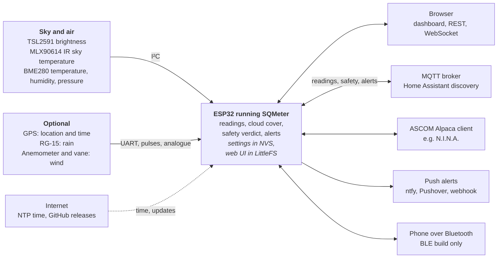

# SQMeter

**ESP32 Dark Sky Quality Monitor**

SQMeter measures light pollution in real time using an ESP32. It gives you SQM magnitude, Bortle class, NELM, cloud cover, temperature, humidity, and pressure — all accessible from any browser on your local network.

## Links

- **Docs:** https://sqmeter.dev/
- **Demo:** https://demo.sqmeter.dev/
- **Releases:** https://github.com/DeanJ87/SQMeter/releases

## How it fits together

<!-- diagram: DIA-01
sources: src/main.cpp#setup include/sensors/ include/WebServer.h include/MQTTClient.h include/AlertDispatcher.h include/BleService.h include/OtaUpdater.h include/TimeManager.h
blocking: false
fingerprint: 85bdfbdf63a4a14b
-->

*Figure: What SQMeter connects to: sensors in, the ESP32 in the middle, and everything it talks to.*

Diagram in words

- **Sensors** into the ESP32: TSL2591 sky brightness, MLX90614 IR sky temperature and BME280 temperature, humidity and pressure on I²C; optional GPS and RG-15 rain gauge on serial (UART); optional anemometer (pulses) and wind vane (analogue).
- **The ESP32** works out the readings, cloud cover, the safety verdict and alerts, with settings in NVS and the web UI in LittleFS.
- **Outputs**: browsers (dashboard, REST, WebSocket); an MQTT broker (readings, safety, alerts, Home Assistant discovery, alerts pause/resume); ASCOM Alpaca clients such as N.I.N.A.; push alerts (ntfy, Pushover, webhook, MQTT); a phone over Bluetooth on the BLE build.
- **From the internet**: NTP time and GitHub releases for updates.

## Highlights

- TSL2591 light sensor — SQM, NELM, Bortle 1–9
- BME280 — temperature, humidity, pressure
- MLX90614 — IR cloud temperature and cloud cover estimate
- GPS support (optional) — location and precise time
- RG-15 rain sensor and anemometer / wind vane support (optional)
- Native ASCOM Alpaca SafetyMonitor + ObservingConditions (N.I.N.A.-compatible, no bridge), tested with ConformU on every PR
- Safety rules for rain, wind, cloud, SQM, humidity and dew point, with the reasons shown and a safe delay
- Alerts via Pushover, ntfy, webhook, MQTT or a paired phone over Bluetooth — per-event levels and sounds, your own wording, only when it's dark, sent any time or only while an imaging app is connected, a pause switch for Home Assistant, and an alert when the imaging app goes quiet.
- Real-time dashboard with reorderable cards and a Sun & Moon night chart
- REST API and MQTT publishing (including a 1/0 safe flag for logging)
- OTA firmware updates from the browser, or self-updated directly from GitHub Releases
- Captive portal Wi-Fi setup on first boot

## Quick Start

See [Flashing Your Device](https://sqmeter.dev/getting-started/flashing/) to get started with a new ESP32.

## Current Security Model

SQMeter is intended for a trusted local network. The current firmware has no web/API authentication, unauthenticated OTA endpoints, and exposes saved configuration through the LAN API. Do not port-forward the device or place it on guest WiFi.
