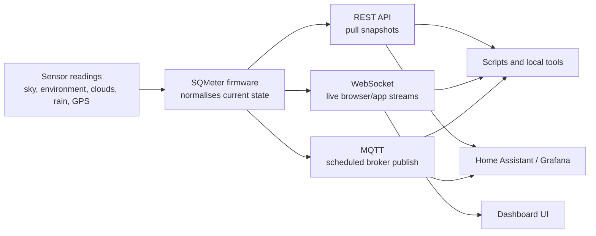

# Integrations

SQMeter exposes device data through three supported integration paths. The legacy raw TCP server that previously ran on port 2020 has been removed.

## Supported integration paths



### REST API

Pull sensor data, status, and configuration over plain HTTP. See [REST API](rest.md) for full endpoint reference.

```bash
# Current sensor readings
curl http://sqmeter.local/api/sensors

# System status
curl http://sqmeter.local/api/status

# Configuration
curl http://sqmeter.local/api/config
```

### WebSocket

Real-time streaming over persistent connections. Connect to `/ws/sensors` for live sensor data (1 second cadence) or `/ws/status` for system status (2 second cadence). See [WebSocket](websocket.md) for details.

### MQTT

Configure SQMeter to publish to an MQTT broker on a schedule. See [MQTT Integration](../user-guide/mqtt.md) for setup.

---

## Legacy TCP server (removed)

The raw TCP server that previously accepted colon-command strings on port 2020 has been removed. It provided an ASCOM ObservingConditions-compatible interface, but the same data is available through the REST API and MQTT.

If you used the port 2020 TCP interface to drive observatory automation software (N.I.N.A., Voyager, Sequence Generator Pro), the recommended migration paths are:

| Capability | Old path | Replacement |
|------------|----------|-------------|
| Sky quality / SQM | TCP `:003#` | `GET /api/sensors` → `skyQuality.sqm` |
| Humidity | TCP `:028#` | `GET /api/sensors` → `environment.humidity` |
| Pressure | TCP `:029#` | `GET /api/sensors` → `environment.pressure` |
| Ambient temp | TCP `:030#` | `GET /api/sensors` → `environment.temperature` |
| Dew point | TCP `:031#` | `GET /api/sensors` → `environment.dewpoint` |
| Sky temperature | TCP `:035#` | `GET /api/sensors` → `irTemperature.objectTemp` |
| Cloud cover | TCP `:038#` | `GET /api/sensors` → `cloudConditions.cloudCoverPercent` |
| Rain rate | TCP `:051#` | `GET /api/sensors` → `rainSensor.rInt` |

Most observatory automation tools that previously supported the SQMeter TCP interface can be configured to query a REST endpoint via HTTP instead, either natively or via a local bridge script.
