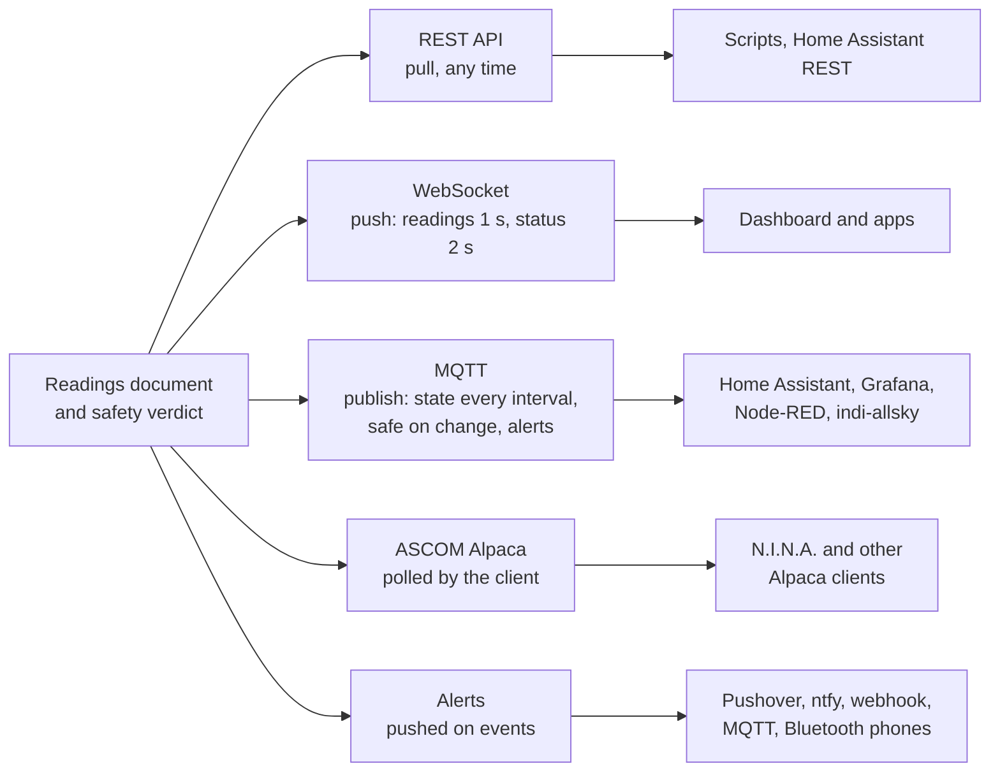

# Integrations

SQMeter exposes device data through these integration paths. The legacy raw TCP server that previously ran on port 2020 has been removed.

## Supported integration paths

<!-- diagram: DIA-15
sources: include/WebServer.h include/MQTTClient.h include/AlertDispatcher.h include/BleService.h lib/AlpacaLogic/include/AlpacaRouter.h lib/Readings/include/
blocking: false
fingerprint: 8411f32c626ac3dc
-->
<figure class="diagram" markdown>


```mermaid
flowchart LR
    accTitle: Integration paths
    accDescr: One readings document and the safety verdict feed five paths. REST is pulled by scripts and Home Assistant; WebSocket pushes live to the dashboard and apps; MQTT publishes to a broker for Home Assistant, Grafana and indi-allsky; Alpaca is polled by N.I.N.A. and other clients; alerts are pushed to phones and services.
    DATA["Readings document<br/>and safety verdict"]
    DATA --> REST["REST API<br/>pull, any time"]
    DATA --> WS["WebSocket<br/>push: readings 1 s, status 2 s"]
    DATA --> MQTT["MQTT<br/>publish: state every interval,<br/>safe on change, alerts"]
    DATA --> ALPACA["ASCOM Alpaca<br/>polled by the client"]
    DATA --> ALERTS["Alerts<br/>pushed on events"]
    REST --> SCRIPTS["Scripts, Home Assistant REST"]
    WS --> UI["Dashboard and apps"]
    MQTT --> HA["Home Assistant, Grafana,<br/>Node-RED, indi-allsky"]
    ALPACA --> NINA["N.I.N.A. and other<br/>Alpaca clients"]
    ALERTS --> PHONES["Pushover, ntfy, webhook,<br/>MQTT, Bluetooth phones"]
```

<figcaption>Integration paths: which way the data flows on each, and who typically uses it.</figcaption>
</figure>

??? info "Diagram in words"

    The same readings document and safety verdict feed every path:

    - **REST API**: pulled any time, by scripts and Home Assistant's REST integrations.
    - **WebSocket**: pushed live, readings every second and status every 2 seconds, to the dashboard and apps.
    - **MQTT**: published to your broker - the state every publish interval, the safe flag on every change, and alerts - for Home Assistant, Grafana, Node-RED or indi-allsky.
    - **ASCOM Alpaca**: polled by N.I.N.A. and other Alpaca clients.
    - **Alerts**: pushed when something happens, to Pushover, ntfy, a webhook, MQTT, or phones over Bluetooth.

### REST API

Pull sensor data, status, and configuration over plain HTTP. See [REST API](rest.md) for full endpoint reference.

```bash
# Current sensor readings
curl http://sqmeter.local/api/sensors

# System status
curl http://sqmeter.local/api/status

# Configuration
curl http://sqmeter.local/api/config
```

### WebSocket

Real-time streaming over persistent connections. Connect to `/ws/sensors` for live sensor data (1 second cadence) or `/ws/status` for system status (2 second cadence). See [WebSocket](websocket.md) for details.

### MQTT

Configure SQMeter to publish to an MQTT broker on a schedule, plus a retained safe/unsafe flag (`<topic>/safe`) and an alerts pause/resume switch for Home Assistant. See [MQTT Integration](../user-guide/mqtt.md) for setup.

### ASCOM Alpaca

Native SafetyMonitor and ObservingConditions devices for N.I.N.A. and other Alpaca clients, found by Alpaca discovery - no driver or bridge. See [ASCOM Alpaca](../user-guide/alpaca.md).

### Alerts

The device sends its own notifications via Pushover, ntfy, a webhook or MQTT, and can ring a paired phone over Bluetooth. See [Alerts](../user-guide/alerts.md) and [Bluetooth](../user-guide/ble.md).

---

## Legacy TCP server (removed)

The raw TCP server that previously accepted colon-command strings on port 2020 has been removed. It provided an ASCOM ObservingConditions-compatible interface, but the same data is available through the REST API and MQTT.

If you used the port 2020 TCP interface to drive observatory automation software (N.I.N.A., Voyager, Sequence Generator Pro), use the native [ASCOM Alpaca](../user-guide/alpaca.md) devices instead. For scripts, the REST equivalents are:

| Capability | Old path | Replacement |
|------------|----------|-------------|
| Sky quality / SQM | TCP `:003#` | `GET /api/sensors` → `sky.sqm` |
| Humidity | TCP `:028#` | `GET /api/sensors` → `environment.humidity` |
| Pressure | TCP `:029#` | `GET /api/sensors` → `environment.pressure` |
| Ambient temp | TCP `:030#` | `GET /api/sensors` → `environment.temperature` |
| Dew point | TCP `:031#` | `GET /api/sensors` → `environment.dewpoint` |
| Sky temperature | TCP `:035#` | `GET /api/sensors` → `infrared.skyTemperature` |
| Cloud cover | TCP `:038#` | `GET /api/sensors` → `clouds.coverPercent` |
| Rain rate | TCP `:051#` | `GET /api/sensors` → `rain.intensity` (mm/h) |

Most observatory automation tools that previously supported the SQMeter TCP interface can be configured to query a REST endpoint via HTTP instead, either natively or via a local bridge script.
