# Translations

The web UI is translated into 13 languages besides English (spec 023). This page is for contributors: how text gets into the UI, how the language files are made and checked, and how the device gets them.

## How it fits together

<!-- diagram: DIA-16
sources: tools/i18n/gen_device_catalog.py tools/i18n/translate.py tools/i18n/build_packs.py src/LanguagePack.cpp web/src/i18n/loader.ts
blocking: false
fingerprint: 78a5e3dff47c16cd
-->

```mermaid
flowchart LR
    accTitle: How a translation reaches the device
    accDescr: The UI's English strings and the firmware's messages go into en.json. The translation tool turns new and changed keys into a file per language. The release job builds a gzip file and checksum for each language. The device downloads its language's file over HTTPS into its storage, and the web UI loads it from the device before it starts.
    src["web/src (t() calls)"] --> en["web/src/i18n/en.json<br/>+ en.context.json"]
    fw["firmware messages<br/>(lib/, src/)"] -->|gen_device_catalog.py| en
    en -->|translate.py + review| loc["web/src/i18n/locales/&lt;code&gt;.json"]
    loc -->|build_packs.py in the release job| rel["release assets<br/>sqmeter-i18n-&lt;code&gt;.json.gz + .sha256"]
    rel -->|HTTPS download| dev["device LittleFS<br/>/lang.json.gz"]
    dev -->|GET /lang.json| ui["web UI"]
```

<figure class="diagram" markdown>



<figcaption>How a translation reaches the device: from the English source to the file the device stores and serves.</figcaption>
</figure>

<details><summary>Diagram in words</summary>

- The UI's `t()` strings and the firmware's messages (through `gen_device_catalog.py`) make up `web/src/i18n/en.json`, with a context note per key.
- `translate.py` (with a review pass) turns new and changed keys into `web/src/i18n/locales/<code>.json`.
- The release job's `build_packs.py` makes `sqmeter-i18n-<code>.json.gz` and its `.sha256` for each language.
- The device downloads its language's file over HTTPS into LittleFS (`/lang.json.gz`), and the web UI loads it from `/lang.json` before it starts.

</details>

- **English is built in**: `web/src/i18n/en.json` is bundled with the UI and is the fallback for every key.
- **Other languages are files**: a release publishes `sqmeter-i18n-<code>.json.gz` (gzip of `{lang, version, messages}`, at most 64 KB) with a `.sha256` sidecar (`"<hash> <size>"`) and `sqmeter-i18n-manifest.json`.
- **The device downloads one file**: when `language` changes, `src/LanguagePack` fetches the sidecar and the file over the same TLS path as firmware updates (never during one), checks size, gzip header and SHA-256, and renames it into place. English deletes it. Manual upload: `POST /api/i18n/upload`. See the [REST API](../api/rest.md#language).
- **The UI loads it before the app**: `web/src/main.tsx` asks `/api/i18n`, fetches `/lang.json`, then imports the app. A missing or damaged file, or one from another version, leaves English (per key) and a notice.
- **Device text** (settings errors, safety reasons, alert history, API errors) stays English on the wire. `tools/i18n/gen_device_catalog.py` turns each firmware message into a `device.*` template in `en.json`; the UI matches device text against the templates (`deviceText()`, `deviceError()`) and shows the translation.

## Writing UI text

- Use `t('area.key', { name: value })` from `web/src/i18n`. Placeholders are `{name}`; plurals are objects keyed by CLDR category (`{"one": "{count} channel", "other": "{count} channels"}`), filled with `{count}`.
- Never build a sentence from pieces (`a + ' and ' + b`, `` `${n} samples` ``). Use one key with placeholders, `Intl.ListFormat` for lists, and `web/src/i18n/format.ts` for numbers, times and durations.
- Don't call `t()` when a module loads (rule I18N-04).
- Add a context note for every new key in `web/src/i18n/en.context.json`: where it appears and any length limit (`max 16 chars`). `python3 tools/i18n/context.py` adds a generated note you can improve.
- Layout: logical CSS properties only, so Arabic mirrors (I18N-03).

The rules are I18N-01..04 in the [coding standard](coding-standards.md#translations-i18n).

## Adding or changing a string

1. Change the English in `en.json` (and the note in `en.context.json`).
2. Translate the new and changed keys:

    ```bash
    python3 tools/i18n/translate.py --all --dry-run   # what changed since the last translation
    ANTHROPIC_API_KEY=... python3 tools/i18n/translate.py --all
    ```

    For each language it sends only the keys whose English changed (tracked in `tools/i18n/record.json`), with their context notes, the glossary (`tools/i18n/glossary/<code>.json`: terms, the names to keep, the register) and the plural forms. A second call reviews the draft as a native UI editor and back-translates the safety strings. The result is checked with `check.mjs` and written only if it passes; the review notes are appended to `tools/i18n/review/<code>.md`.

3. If you edit a translation by hand instead, mark it current: `python3 tools/i18n/translate.py --lang es --record`.

## Checks

| Check | What it does | Where |
|---|---|---|
| `node tools/i18n/literals.mjs` | I18N-01: no hard-coded UI text | quality gate, build |
| `node tools/i18n/check.mjs` | completeness, extra keys, placeholders, plural forms, edge spaces, context notes, glossaries (`--review` adds a worklist: glossary misses, untranslated text, length) | quality gate (I18N-02), build |
| `gen_device_catalog.py --check`, `context.py --check` | generated files are current | quality gate, build |
| `python3 -m unittest discover -s tools/i18n` | the translation tool and the file builder | build |
| `build_packs.py` | every file builds under 64 KB | build, release |
| `web/tests/i18n.spec.ts` | every page in every language at 320 px and 1280 px: `lang`/`dir`, no sideways scroll, screenshots; Arabic with the axe checks and left-to-right readings | Deploy Docs & Demo |

Run the Playwright check for some languages only: `I18N_LANGS=ar,de npx playwright test tests/i18n.spec.ts`. The demo opens in a language with `?lang=<code>`.

## Adding a language

1. Add it to `web/src/i18n/languages.ts` and `lib/LanguageLogic` (the device validates the code).
2. Write `tools/i18n/glossary/<code>.json` (terms, register, notes).
3. Run `translate.py --lang <code>`, then the review: `node tools/i18n/check.mjs --review` and a note in `tools/i18n/review/<code>.md` with the safety strings back-translated.
4. Run the Playwright check for the language.
