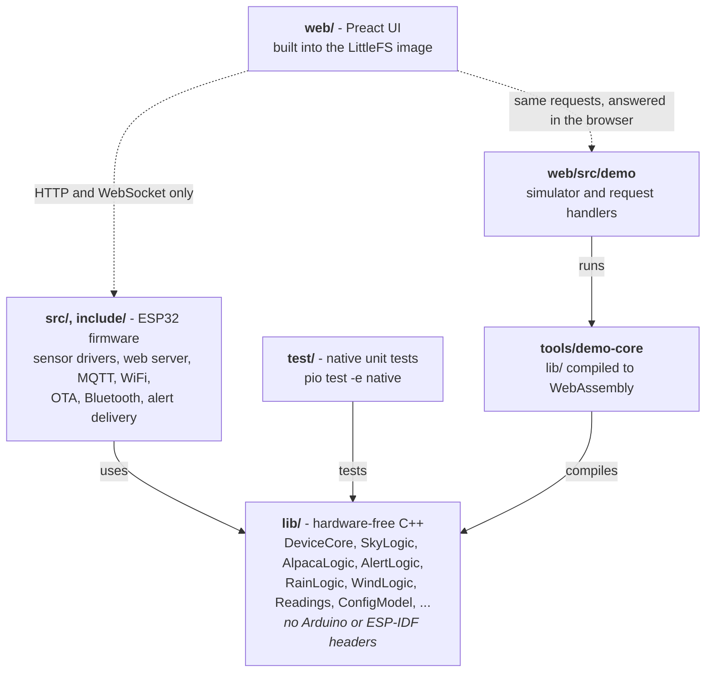
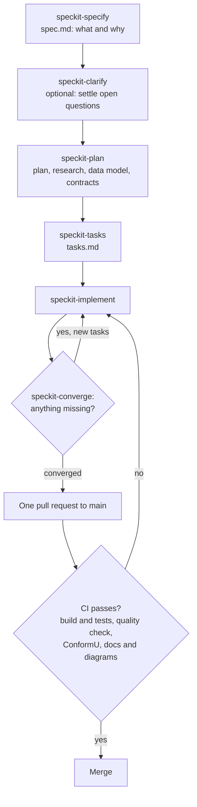

# Dev Workflow

## How the code fits together

<!-- diagram: DIA-11
sources: lib/ tools/demo-core/bridge.cpp platformio.ini
blocking: false
fingerprint: 72b42b80c06425c3
-->
<figure class="diagram" markdown>



<figcaption>Code layers: everything depends on the hardware-free <code>lib/</code>, never the other way round.</figcaption>
</figure>

??? info "Diagram in words"

    - **`lib/`** holds the hardware-free logic: the device core, sky quality and cloud maths, Alpaca, alerts, rain and wind, the readings schema, settings and more. It never includes Arduino or ESP-IDF headers.
    - **`src/` and `include/`** are the ESP32 firmware: sensor drivers, the web server, MQTT, WiFi, OTA, Bluetooth and alert delivery. They use `lib/`.
    - **`test/`** runs `lib/` natively on a computer (`pio test -e native`).
    - **`tools/demo-core`** compiles `lib/` to WebAssembly; the demo's simulator and request handlers in **`web/src/demo`** run it in the browser.
    - **`web/`** is the Preact UI. It has no code dependency on the firmware: it talks to it over HTTP and WebSocket, and in the demo the same requests are answered in the browser.

## Spec-driven changes

<!-- diagram: DIA-14
sources: .specify/memory/constitution.md .claude/skills/
blocking: false
fingerprint: 169bfbc5a4698e58
-->
<figure class="diagram" markdown>



<figcaption>Spec-driven changes: from a spec to a merged pull request.</figcaption>
</figure>

??? info "Diagram in words"

    1. **Specify**: `spec.md` says what the feature does and why. **Clarify** settles open questions, when there are any.
    2. **Plan**: the plan, research, data model and contracts. **Tasks**: `tasks.md`.
    3. **Implement** the tasks, then **converge**: compare the code with the spec and add a task for anything missing. Repeat until converge reports nothing missing.
    4. Open **one pull request** to `main`. It merges only when CI passes: the build and tests, the quality check (`tools/quality/check.py`, the [coding standard](coding-standards.md)), ConformU against the Alpaca simulator, and the docs build with its diagram checks.

---

## Prerequisites

- [PlatformIO CLI](https://platformio.org/install/cli) or VS Code with PlatformIO extension
- Node.js 24+
- Python 3

---

## Key Facts About Storage

Config lives in **NVS** (Non-Volatile Storage) — a separate 20 KB partition at `0x9000`. This means:

!!! success "Safe to do freely"
    - `pio run --target upload` — reflash firmware, WiFi config untouched
    - `pio run --target uploadfs` — update web UI, WiFi config untouched

!!! danger "Clears everything"
    `pio run --target erase` followed by re-flash — only do this to force the captive portal

---

## Firmware Development (C++)

```bash
# Build
pio run

# Build + upload
pio run --target upload

# Serial monitor
pio device monitor
```

Source lives in `src/` and `include/`. PlatformIO handles the toolchain.

---

## Frontend Development (TypeScript / Preact)

### Option A — Live dev server (recommended)

Proxies API and WebSocket calls to your real device:

```bash
cd web
ESP32_IP=192.168.1.42 npm run dev
```

Open `http://localhost:5173`. Changes hot-reload instantly. WebSocket works through the Vite proxy.

### Option B — Build and flash

```bash
cd web
npm run build
cd ..
pio run --target uploadfs
```

---

## Full Build (CI equivalent)

```bash
cd web && npm install && npm run build && cd ..
cp -r web/dist data
pio run                  # firmware
pio run --target buildfs # littlefs image
```

---

## NVS Details

| Property | Value |
|----------|-------|
| Partition | `nvs` at `0x9000` |
| Namespace | `sqm` |
| Key | `config` |
| Survives | Firmware uploads, filesystem uploads, power cycles |
| Cleared by | Full chip erase only |

To force the captive portal (reset all config):

```bash
esptool.py --chip esp32 --port PORT erase_flash
pio run --target upload
pio run --target uploadfs
```
