# First Boot

SQMeter ships with no WiFi credentials. On first power-on it starts in **hotspot mode** — it broadcasts its own open WiFi network so you can configure it from any phone or laptop.

<!-- diagram: DIA-07
sources: src/WiFiManager.cpp#WiFiManager::begin src/WiFiManager.cpp#WiFiManager::startCaptivePortal src/WiFiManager.cpp#WiFiManager::updateCredentials lib/CaptiveDns/ src/WebServerApi.cpp#WebServer::pollWiFiConnect src/WebServer.cpp#WebServer::setupStaticRoutes src/main.cpp#loop
blocking: false
fingerprint: fb56b42c1b6b30b5
-->

```mermaid
sequenceDiagram
    accTitle: First setup
    accDescr: The device opens the SQM-Setup hotspot and answers every name lookup with itself, so the phone's sign-in window opens the WiFi setup screen. After you pick a network, the device joins it while keeping the hotspot, saves it once joined, shows its new address and restarts on your network about 15 seconds later.
    participant P as Phone or laptop
    participant D as SQMeter
    participant R as Your WiFi
    Note over D: No saved network, or it isn't joined within 45 s of power-on
    D->>D: Open the SQM-Setup hotspot, 192.168.4.1
    P->>D: Join SQM-Setup
    P->>D: Look up any name
    D-->>P: Every name is 192.168.4.1
    P->>D: Sign-in check, e.g. /hotspot-detect.html
    D-->>P: Redirect to /wifi
    Note over P: The sign-in window shows the WiFi setup screen
    P->>D: Choose a network, enter its password
    D->>R: Join, keeping the hotspot up
    opt Joined within 10 s
        D->>D: Save the network
        D-->>P: Joined: sqmeter.local and its IP
        D->>D: About 15 s later, restart on your network
        P->>R: Rejoin your own network
        P->>D: Open sqmeter.local or the IP
    end
    opt Wrong password or no answer within 10 s
        D-->>P: Not joined, try again
    end
```

<figure class="diagram" markdown>



<figcaption>First setup: from the SQM-Setup hotspot to the device on your own network.</figcaption>
</figure>

??? info "Diagram in words"

    1. With no saved network, or when the saved one hasn't been joined within 45 seconds of power-on, the device opens the open **SQM-Setup** hotspot at 192.168.4.1 (and keeps retrying the saved network in the background).
    2. Your phone or laptop joins SQM-Setup. The device answers every name lookup with its own address, and redirects the system's sign-in checks (such as `/hotspot-detect.html`) to `/wifi`, so the sign-in window opens the WiFi setup screen.
    3. You choose a network and enter its password. The device joins it while keeping the hotspot up.
    4. **Joined within 10 seconds**: the device saves the network, the screen shows `sqmeter.local` and the IP, and about 15 seconds later the device restarts on your network and the hotspot goes. Rejoin your own network and open that address.
    5. **Wrong password or no answer**: the screen says it didn't join, and you can try again.

---

## Step 1 — Power On

Connect the ESP32 to USB or a 5V supply. Within a few seconds it broadcasts:

```
SSID:     SQM-Setup
Password: (none — open network)
```

---

## Step 2 — Connect to the Hotspot

Connect your phone or laptop to **SQM-Setup**. No password required.

=== "iOS / Android"
    A **"Sign in to network"** notification will appear automatically. Tap it to open the captive portal in your browser.

=== "macOS"
    A sign-in sheet pops up automatically in Safari after joining the network.

=== "Windows"
    Click the network notification or open a browser — Windows will redirect you to the portal.

=== "Linux"
    Open a browser and navigate to `http://192.168.4.1/wifi` manually.

If no sign-in window appears on any system, open `http://192.168.4.1/wifi`.

---

## Step 3 — Configure WiFi

The sign-in window opens the **WiFi setup** screen with a list of nearby networks:


1. Select your home/lab network (or **Other network...** for a hidden one)
2. Enter the password
3. Tap **Connect**

When the device has joined, the screen shows its new address — `http://sqmeter.local` and its IP. About 15 seconds later the device restarts on your network and the hotspot disappears. Reconnect your phone or laptop to your own network and open that address.

If the password is wrong the screen says so and you can try again.

!!! note "2.4 GHz only"
    ESP32 does not support 5 GHz. If your router broadcasts both bands under the same SSID, the device will pick the 2.4 GHz band automatically.

---

## Step 4 — Find the Device

After connecting, SQMeter is reachable at:

```
http://sqmeter.local      # mDNS — works on most networks
http://<device-ip>        # Direct IP — always works
```

The name comes from **Settings → Network → WiFi → Hostname** (default `sqmeter`). **Advertise on the network (mDNS)** can be turned off there if your network doesn't allow multicast; then use the IP.

The IP address is logged over serial (115200 baud) if you have a monitor connected. You can also check your router's DHCP client list for a host named `sqmeter`.

---

## Step 5 — Access the Dashboard

Open the web UI. You should see live sensor readings on the Dashboard within a few seconds of the sensors initialising.

---

## If the WiFi is Down at Startup

If the saved network can't be joined within 45 seconds of power-on (for example the router is slower to start after a power cut), SQMeter also opens the **SQM-Setup** hotspot so you can change the network, and keeps retrying the saved one in the background. As soon as it reconnects, it restarts onto your network. A shorter outage at boot, or any outage later on, only reconnects: the hotspot stays closed.

---

## WiFi Config is Persistent

Credentials live in the NVS partition — completely separate from firmware and filesystem storage:

| Action | WiFi config |
|--------|------------|
| Flash new firmware | ✅ Preserved |
| Update web UI filesystem | ✅ Preserved |
| Power cycle | ✅ Preserved |
| Full chip erase | ❌ Cleared |

To force the hotspot again (reset WiFi config):

```bash
esptool.py --chip esp32 --port PORT erase_flash
```

Then re-flash from the release binaries.
