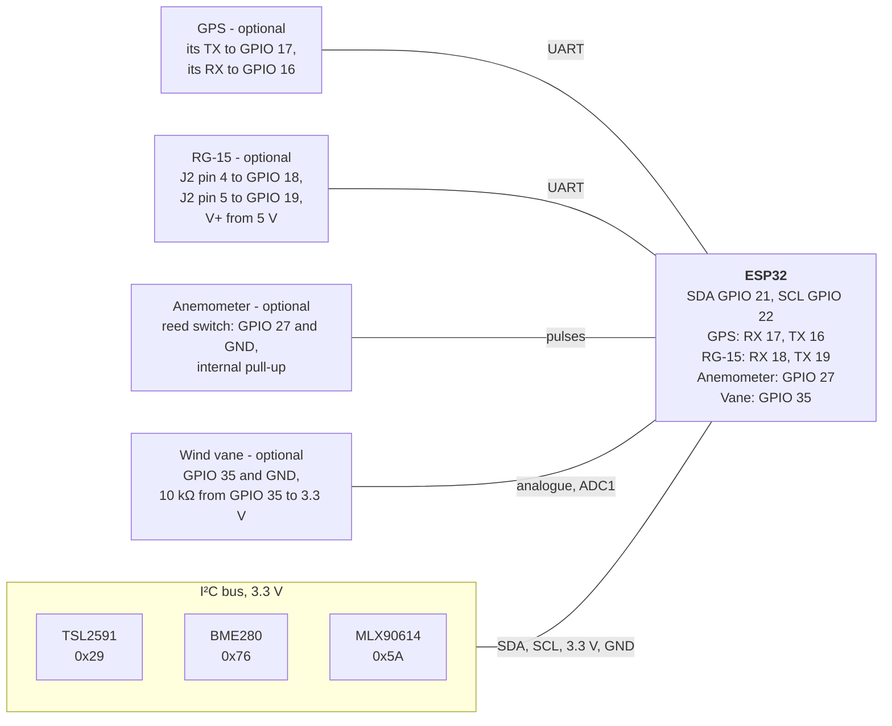

# Hardware Setup

SQMeter runs on any standard ESP32 dev board. The three core sensors share the I²C bus; the optional GPS, RG-15 rain gauge and anemometer/vane have their own pins.

<!-- diagram: DIA-13
sources: lib/ConfigModel/src/ConfigModel.cpp#createDefault src/main.cpp#setupI2C src/sensors/WindSensor.cpp
blocking: false
fingerprint: cb8354ff672be2b4
-->
<figure class="diagram" markdown>



<figcaption>Wiring overview with the default pins; every pin can be changed under <b>Settings → Sensors</b> and <b>Time &amp; Location</b>.</figcaption>
</figure>

??? info "Diagram in words"

    - **I²C bus** (3.3 V, GND, SDA on GPIO 21, SCL on GPIO 22): TSL2591 at `0x29`, BME280 at `0x76`, MLX90614 at `0x5A`, wired in parallel.
    - **GPS** (optional, UART): the GPS's TX to GPIO 17 (ESP32 RX), its RX to GPIO 16 (ESP32 TX).
    - **RG-15** (optional, UART): J2 pin 4 (sensor TX) to GPIO 18, J2 pin 5 (sensor RX) to GPIO 19, V+ from 5 V. See [RG-15](../hardware/rg15.md) for its connector and signal levels.
    - **Anemometer** (optional): the reed switch between GPIO 27 and GND; the internal pull-up is used.
    - **Wind vane** (optional): between GPIO 35 and GND, with a 10 kΩ resistor from GPIO 35 to 3.3 V. It must be an ADC1 pin (GPIO 32-39). See [Wind](../hardware/wind.md).
    - All pins can be changed in settings; settings reject pins that clash.

---

## Wiring

Default I2C pins (configurable in settings):

| ESP32 Pin | Function | Sensor Pins |
|-----------|----------|-------------|
| GPIO 21 | SDA | SDA on all sensors |
| GPIO 22 | SCL | SCL on all sensors |
| 3.3V | Power | VIN / VCC |
| GND | Ground | GND |

All sensors share the same two-wire I2C bus. Wire them in parallel.

```
ESP32          TSL2591     BME280      MLX90614
 3V3  ─────────  VIN ──────  VCC ──────  VCC
 GND  ─────────  GND ──────  GND ──────  GND
 G21  ─────────  SDA ──────  SDA ──────  SDA
 G22  ─────────  SCL ──────  SCL ──────  SCL
```

---

## I2C Addresses

| Sensor | Default Address | Notes |
|--------|----------------|-------|
| TSL2591 | `0x29` | Fixed |
| BME280 | `0x76` | `0x77` if SDO pulled high |
| MLX90614 | `0x5A` | Fixed |

!!! warning "Address conflict"
    If you have multiple BME280s on the same bus, one must be wired with SDO to 3.3V to use address `0x77`.

---

## Sensor Placement

For accurate sky readings:

- **TSL2591** should have a clear, unobstructed view of the sky — point it straight up
- **MLX90614** measures cloud temperature and should also face the sky
- **BME280** should be shaded from direct sunlight and have airflow — don't enclose it tightly
- Keep all sensors away from artificial light sources

---

## Verified Hardware

| Component | Notes |
|-----------|-------|
| ESP32 DevKit v1 | 30-pin or 38-pin, both work |
| Adafruit TSL2591 | Breakout board recommended |
| Adafruit BME280 | Breakout board recommended |
| Adafruit MLX90614 | Optional — for cloud detection |
| u-blox NEO-6M GPS | Optional — for location/time sync |

!!! tip "Power"
    Power the ESP32 via USB or a 5V supply. The 3.3V regulator on most dev boards can comfortably drive all sensors simultaneously.
