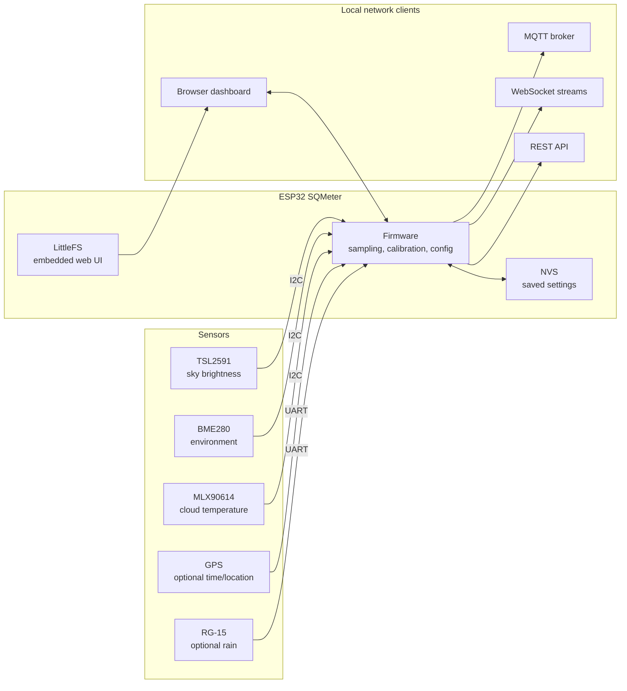

# SQMeter

**ESP32 Dark Sky Quality Monitor**

SQMeter is an open-source sky quality meter built on the ESP32. It measures light pollution in real time and gives you Bortle class, SQM magnitude, and naked-eye limiting magnitude — accessible from any browser on your local network.

[Try the Live Demo :material-arrow-right:](https://DeanJ87.github.io/SQMeter/demo/){ .md-button .md-button--primary }
[View on GitHub :fontawesome-brands-github:](https://github.com/DeanJ87/SQMeter){ .md-button }

---

---

## Features

- :material-telescope: **Sky Quality Measurements**

    SQM (mag/arcsec²), NELM, and Bortle Scale 1–9 calculated from raw lux.

- :material-wifi: **Web Interface**

    Real-time dashboard over WebSocket. No polling. No app required.

- :material-thermometer: **Environmental Sensors**

    Temperature, humidity, and pressure via BME280.

- :material-broadcast: **MQTT Publishing**

    Push readings to Home Assistant, Grafana, or any MQTT broker.

- :material-update: **OTA Updates**

    Flash new firmware from the browser — no USB cable needed after first flash.

- :material-lock-open: **Open Hardware**

    Standard I2C sensors. Runs on any ESP32 dev board.

---

## Sensors

| Sensor | Measures | Interface |
|--------|----------|-----------|
| TSL2591 | Lux (full / visible / IR) | I2C `0x29` |
| BME280 | Temperature, humidity, pressure | I2C `0x76` |
| MLX90614 | IR cloud temperature | I2C `0x5A` |
| GPS (optional) | Location & time | UART |
| RG-15 (optional) | Rain detection | UART |

---

## Quick Start

New device? Go to [Flashing Your Device](getting-started/flashing.md) — you only need a USB cable and the release binaries.

Already flashed? Go to [First Boot](getting-started/first-setup.md) to configure WiFi.
