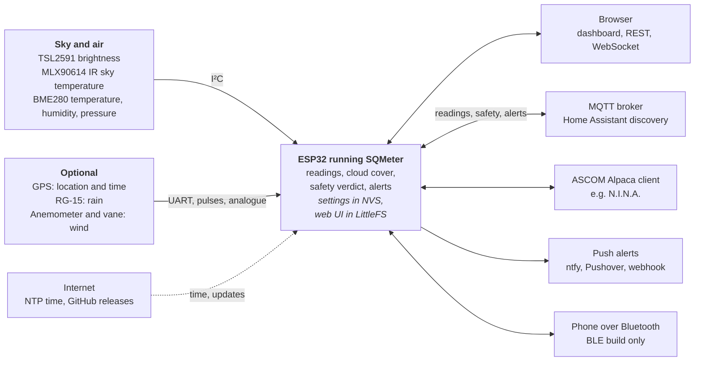

# SQMeter

21.47

mag / arcsec² · Bortle 2 · Typical truly dark site

ESP32 dark sky quality monitor - sky brightness, cloud, rain and wind, an observatory safety monitor for N.I.N.A., and alerts that wake you when it matters.

SQMeter is an open-source sky quality meter built on the ESP32. It measures light pollution in real time and gives you Bortle class, SQM magnitude, and naked-eye limiting magnitude — accessible from any browser on your local network.

[Try the Live Demo :material-arrow-right:](https://demo.sqmeter.dev/){ .md-button .md-button--primary }
[View on GitHub :fontawesome-brands-github:](https://github.com/DeanJ87/SQMeter){ .md-button }

<!-- diagram: DIA-01
sources: src/main.cpp#setup include/sensors/ include/WebServer.h include/MQTTClient.h include/AlertDispatcher.h include/BleService.h include/OtaUpdater.h include/TimeManager.h
blocking: false
fingerprint: 85bdfbdf63a4a14b
-->
<figure class="diagram" markdown>

```mermaid
flowchart LR
    accTitle: What SQMeter connects to
    accDescr: Sensors feed the ESP32. It keeps its settings and web UI on the device, serves a dashboard and APIs to browsers, publishes to an MQTT broker, answers ASCOM Alpaca clients such as N.I.N.A., and sends alerts to push services and paired phones.
    I2C["<b>Sky and air</b><br/>TSL2591 brightness<br/>MLX90614 IR sky temperature<br/>BME280 temperature, humidity, pressure"]
    OPT["<b>Optional</b><br/>GPS: location and time<br/>RG-15: rain<br/>Anemometer and vane: wind"]
    ESP["<b>ESP32 running SQMeter</b><br/>readings, cloud cover,<br/>safety verdict, alerts<br/><i>settings in NVS,<br/>web UI in LittleFS</i>"]
    WEB["Browser<br/>dashboard, REST, WebSocket"]
    MQTT["MQTT broker<br/>Home Assistant discovery"]
    ALPACA["ASCOM Alpaca client<br/>e.g. N.I.N.A."]
    PUSH["Push alerts<br/>ntfy, Pushover, webhook"]
    PHONE["Phone over Bluetooth<br/>BLE build only"]
    NET["Internet<br/>NTP time, GitHub releases"]
    I2C -->|I²C| ESP
    OPT -->|UART, pulses, analogue| ESP
    NET -.->|time, updates| ESP
    ESP <--> WEB
    ESP <-->|readings, safety, alerts| MQTT
    ESP <--> ALPACA
    ESP --> PUSH
    ESP <--> PHONE
```

<figcaption>What SQMeter connects to: sensors in, the ESP32 in the middle, and everything it talks to.</figcaption>
</figure>

??? info "Diagram in words"

    - **Sensors** (into the ESP32):
        - TSL2591 sky brightness, MLX90614 IR sky temperature and BME280 air temperature, humidity and pressure, on the I²C bus.
        - Optional GPS (location and time) and RG-15 rain gauge on serial (UART).
        - Optional anemometer (pulses) and wind vane (analogue).
    - **The ESP32** works out the readings, cloud cover, the safety verdict and alerts. It keeps its settings in NVS and the web UI's files in LittleFS.
    - **Outputs:**
        - Browsers get the dashboard, the REST API and live WebSocket updates.
        - An MQTT broker gets readings, the safety verdict and alerts, with Home Assistant discovery; it can also switch alerts on and off.
        - ASCOM Alpaca clients such as N.I.N.A. read the SafetyMonitor and ObservingConditions devices.
        - Alerts go to ntfy, Pushover, a webhook or MQTT.
        - On the Bluetooth (BLE) build, a paired phone gets the safety state and alarms, and can acknowledge them.
    - **From the internet:** NTP time and, when you ask for an update, GitHub releases.

---

## Features

- :material-telescope: **Sky Quality Measurements**

    SQM (mag/arcsec²), NELM, and Bortle Scale 1–9 calculated from raw lux.

- :material-wifi: **Web Interface**

    Real-time dashboard over WebSocket. No polling. No app required.

- :material-thermometer: **Environmental Sensors**

    Temperature, humidity, and pressure via BME280.

- :material-broadcast: **MQTT Publishing**

    Push readings to Home Assistant, Grafana, or any MQTT broker.

- :material-update: **OTA Updates**

    Flash new firmware from the browser, or let the device update itself directly from GitHub Releases.

- :material-connection: **ASCOM Alpaca**

    Native SafetyMonitor + ObservingConditions device for N.I.N.A. — no separate bridge required. Tested with ASCOM ConformU on every change.

- :material-shield-check: **Safety & alerts**

    Rain, wind, cloud, SQM, humidity and dew-point rules. Alerts via Pushover, ntfy, webhook, MQTT or a paired phone over Bluetooth — sent any time, or only while an imaging app is connected, and you're told if it goes quiet.

- :material-weather-windy: **Rain & wind**

    Optional Hydreon RG-15 rain gauge and anemometer / wind vane.

- :material-weather-night: **Sun & Moon**

    Twilight, darkness and moon chart for the night ahead from your location.

- :material-lock-open: **Open Hardware**

    Standard I2C sensors. Runs on any ESP32 dev board.

---

## Sensors

| Sensor | Measures | Interface |
|--------|----------|-----------|
| TSL2591 | Lux (full / visible / IR) | I2C `0x29` |
| BME280 | Temperature, humidity, pressure | I2C `0x76` |
| MLX90614 | IR cloud temperature | I2C `0x5A` |
| GPS (optional) | Location & time | UART |
| RG-15 (optional) | Rain detection | UART |

---

## Quick Start

New device? Go to [Flashing Your Device](getting-started/flashing.md) — you only need a USB cable and the release binaries.

Already flashed? Go to [First Boot](getting-started/first-setup.md) to configure WiFi.
