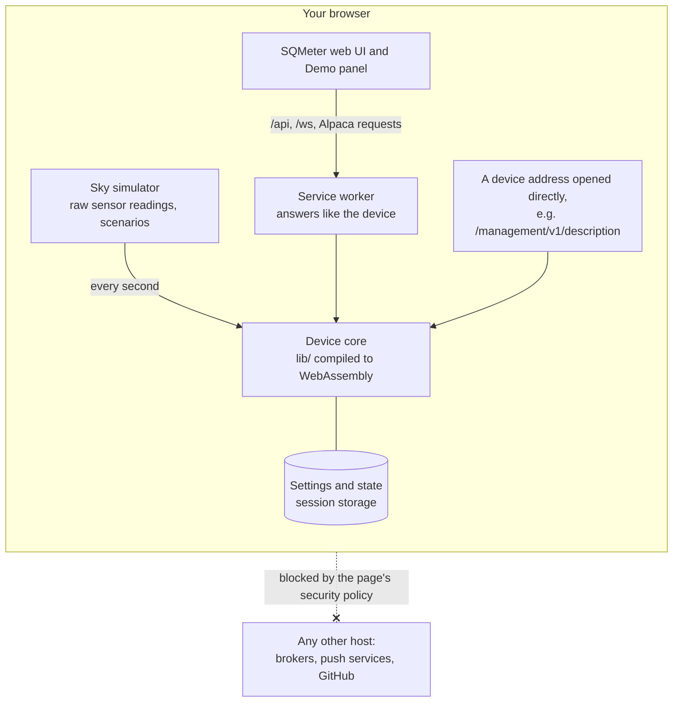

# Live Demo

[Try the Live Demo :material-arrow-right:](https://demo.sqmeter.dev/){ .md-button .md-button--primary }
[Start with a night sky](https://demo.sqmeter.dev/?scenario=night){ .md-button }

The demo is a simulated SQMeter in your browser. It runs **the firmware's own code** - the same sky-quality maths, cloud model, safety rules, alert engine and ASCOM Alpaca API as the device, compiled to WebAssembly - so it behaves the way a real one does. No hardware, no account.

---

## What's real and what's simulated

| Real (the device's code) | Simulated (the demo) |
|---|---|
| SQM, NELM, Bortle, cloud cover, dew point | The raw sensor values, which you set in the Demo panel: light, sky and air temperature, humidity, pressure, rain, wind, GPS |
| The safety verdict, its reasons and the safe delay | The weather, and sensor faults you trigger |
| Alerts: which events fire, their level, wording and stacking | Delivery - nothing is sent to Pushover, ntfy, a webhook or MQTT |
| Settings: defaults, validation and error messages | WiFi, restarts, firmware updates and uploads |
| The Alpaca API N.I.N.A. talks to | The network - the demo never connects to anything |

Because the dashboard, the Alpaca page and the Alpaca API all come from one emulated device, they always agree.

---

## Things to try

Open the **✦ Demo** button (bottom right). It controls what the demo's sensors report, the same raw readings the hardware produces. The device's own code works out everything else.

### Set the sensor readings

Each group sets what one sensor reports:

| Group | Readings |
|---|---|
| **Sky and light** (MLX90614, TSL2591) | Sky temperature, the IR sensor's own temperature, their difference, and illuminance (or **Light follows the sun**) |
| **Air** (BME280) | Temperature, humidity, pressure |
| **Rain** (RG-15) | Rain rate and a lens fault |
| **Wind** | Speed, gust and direction |
| **GPS** | Whether it has a fix (it reports the device's location) |

- **Not responding** on any sensor makes it stop answering until you clear it. Its card goes, the verdict counts it, and a "sensor fault" alert follows.
- Values outside a sensor's real range are limited to it.
- The rain and wind controls are unavailable while that sensor is switched off in **Settings → Sensors**.
- **Hold steady** turns off the small natural variation, for exact readings.

The device reads these through its own settings. With your clear-sky threshold at -30 °C, a sky 32 °C colder than the IR sensor reads clear. Raise the sky temperature and cloud cover rises the way your thresholds say.

### What the device makes of it, and what it's waiting for

At the top of the panel are the device's own results:
- sky quality (SQM, NELM, Bortle)
- cloud cover
- dew point
- rain
- the safety verdict and its reasons
- whether alerts are on

The device smooths and holds some things on purpose. The panel shows what it's waiting for and how long is left, so a change that hasn't shown yet doesn't look broken:

- **Sky brightness averages over 90 s - settled in 40 s**: at night the light sensor averages over the sky averaging window.
- **Rain clear delay**: the time until the device calls it dry again.
- **Safe delay**: the time until the verdict can turn safe.
- **Alert cooldowns and settle times**: why an alert hasn't gone out yet.

### Shortcuts

Shortcuts set the readings for an outcome, **worked out from your current settings**, and say what they used:

| Shortcut | Sets |
|---|---|
| **Clear** / **Overcast** | A sky temperature past your clear-sky or overcast threshold, allowing for the humidity correction |
| **Cloud just unsafe** | Cloud cover just past your cloud cover safety limit |
| **Rain** / **Rain stops** | Rain at 2.5 mm/h, or none |
| **Dark sky** | Illuminance for SQM 21.5 (allowing for your calibration offset) |
| **Dew risk** | Humidity that brings the dew point inside your dew-risk margin |

Cloud changes roll in over 40 seconds; **Change** picks another pace.

If a shortcut can't work with your settings, it says why and changes nothing. Two examples: **Cloud just unsafe** with the cloud rule switched off, and **Rain** with the rain sensor off.

### Time and place

The panel shows the device's date, time, time zone and location. You can set the date and time exactly, or use presets:

- **Now**
- **Darkest tonight**
- **Dawn**, 45 minutes before sunrise
- **Dusk**
- **Midsummer** and **Midwinter midnight**
- **31 Dec 23:00**

The places (**London**, **La Palma**, **Atacama**, **Sydney**, **75° N 1° W** and the **North Pole**) save the location and its time zone, as Settings does. Sun & Moon, darkness, the night-only alerts and the light (when it follows the sun) all follow. Where a preset can't happen, the panel says why and the clock stays put. One example is dawn at the North Pole in December.

**Run the device clock 10× faster** runs the clock, the sun and the device's own delays (rain clear delay, safe delay, alert cooldowns) ten times faster.

Then change settings and watch them take effect:

- **Settings → Time & Location**: turn GPS off, or on and restart - just as on a device, GPS only starts after a restart. Change the location and Sun & Moon, darkness and the device's sun altitude follow.
- **Settings → Safety**: tighten a rule (cloud cover, SQM) past the current reading and the verdict turns unsafe with that reason.
- **Settings → Sensors**: switch the rain gauge or anemometer off and they disappear from the dashboard, the readings and Alpaca.
- **Settings → Alerts**: change an event's level or write your own wording, then **Test** - the alert shows under the bell with "Demo: nothing was sent".
- Enter an invalid value and you get the device's own error message.

Device addresses work too: open [`/management/v1/description`](https://demo.sqmeter.dev/management/v1/description) or [`/api/sensors`](https://demo.sqmeter.dev/api/sensors) to see what the device would answer.

Links can set things up: `https://demo.sqmeter.dev/?scenario=rain`.

| Link | Sets up |
|---|---|
| `night` | Darkest tonight, clear |
| `rain` | Rain |
| `cloud` | Overcast over 40 s |
| `clear` | Clear |
| `dawn` | Dawn |
| `fail-light`, `fail-ir`, `fail-environment`, `fail-rain` | That sensor not responding |

---

## Your changes

Changes last until you close the tab - a refresh keeps them. **Reset demo** in the Demo panel starts over. Nothing is stored anywhere but your own browser.

---

## Nothing leaves your browser

The demo only talks to itself: there is no server behind it, and the page's security policy stops it contacting anything else. Keys or addresses you type into the alert or MQTT settings go nowhere. An automated test exercises every action and checks that no request leaves the page.

<!-- diagram: DIA-12
sources: web/src/demo/device.ts web/src/demo/handlers.ts web/src/demo/simulator.ts web/src/main.tsx tools/demo-core/bridge.cpp web/vite.demo.config.ts
blocking: false
fingerprint: 73dcfb0514095b7b
-->
<figure class="diagram" markdown>

<figcaption>How the demo works: the firmware's own logic, fed by a simulated sky, entirely inside your browser.</figcaption>
</figure>

??? info "Diagram in words"

    - Everything runs in your browser; there is no server behind the demo.
    - The **sky simulator** invents the raw sensor readings (and the scenarios you pick) and feeds them, once a second, to the **device core**: the firmware's own `lib/` code compiled to WebAssembly.
    - The core keeps the settings and state in the tab's **session storage**.
    - The **web UI** and Demo panel make the same requests as on a real device; a **service worker** answers them from the core. Device addresses opened directly (such as `/management/v1/description`) are answered by the core too.
    - The page's security policy blocks every other host, so nothing reaches a broker, a push service or GitHub.

---

## Source

- The device code: [`lib/`](https://github.com/DeanJ87/SQMeter/tree/main/lib), built for the browser by [`tools/demo-core`](https://github.com/DeanJ87/SQMeter/tree/main/tools/demo-core)
- The simulator, request handling and Demo panel: [`web/src/demo/`](https://github.com/DeanJ87/SQMeter/tree/main/web/src/demo)
- The design: [spec 016](https://github.com/DeanJ87/SQMeter/tree/main/specs/016-demo-device-emulation)
