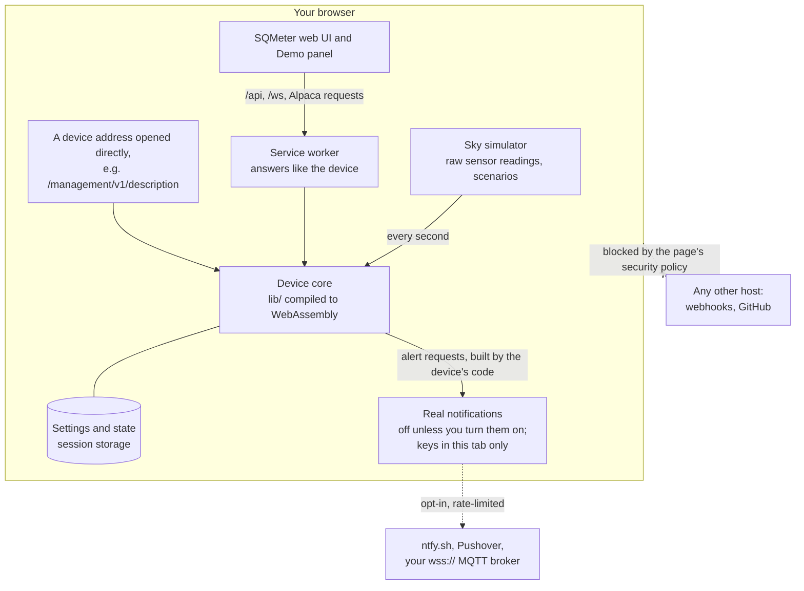

# Live Demo

[Try the Live Demo :material-arrow-right:](https://demo.sqmeter.dev/){ .md-button .md-button--primary }
[Start with a night sky](https://demo.sqmeter.dev/?scenario=night){ .md-button }

The demo is a simulated SQMeter in your browser. It runs **the firmware's own code** - the same sky-quality maths, cloud model, safety rules, alert engine and ASCOM Alpaca API as the device, compiled to WebAssembly - so it behaves the way a real one does. No hardware, no account.

---

## What's real and what's simulated

| Real (the device's code) | Simulated (the demo) |
|---|---|
| SQM, NELM, Bortle, cloud cover, dew point | The raw sensor values: light, sky and air temperature, humidity, pressure, rain, wind, GPS |
| The safety verdict, its reasons and the safe delay | The weather, and sensor faults you trigger |
| Alerts: which events fire, their level, wording and stacking - and the exact requests a device sends | Delivery - nothing is sent, unless you turn on [real notifications](#real-notifications) |
| Settings: defaults, validation and error messages | WiFi, restarts, firmware updates and uploads |
| The Alpaca API N.I.N.A. talks to | The network - the demo connects to nothing unless you opt in |

Because the dashboard, the Alpaca page and the Alpaca API all come from one emulated device, they always agree.

---

## The tour

On your first visit the demo offers a short tour (about two minutes): live readings, the safety verdict, making it unsafe and watching the verdict, the bell and Alpaca agree, changing a rule, and the Demo panel. Steps that ask you to do something wait for the device to react - or press **Do it for me**. **Skip tour** or Esc ends it; **Take the tour** in the Demo panel starts it again. It works with the keyboard alone, on phones, and without animation.

---

## Things to try

Open the **✦ Demo** button (bottom right) for weather and fault scenarios:

| Scenario | What you'll see |
|---|---|
| **Night sky** | The device's clock jumps to the darkest moment tonight, with a clear sky - Sun & Moon, darkness and the sky readings all follow |
| **Rain** ¹ | Raining on the dashboard, the verdict turns unsafe ("Rain detected"), an alert under the bell, and Alpaca IsSafe false - then it clears after the rain clear delay |
| **Cloud over** / **Clear** | Cloud rolls in over about 40 seconds: cover rises past the alert and safety limits, the "Clouded over" alert, an unsafe verdict - and back |
| **Dawn** | The device's clock jumps to the next dawn (sun 12° below the horizon and rising) - turn on 10× to watch the sky brighten, and try an SQM minimum in the safety rules |
| **Sensor fails** ¹ | A sensor stops answering: its card goes, the verdict counts it, a "sensor fault" alert |

¹ The rain scenarios need the rain sensor: they're unavailable while it's switched off in Settings → Sensors.

The panel shows the device's date and time. **Run the device clock 10× faster** runs it - and the sun and moon - ten times faster, and shortens the device's own delays (rain clear delay, safe delay, alert cooldowns) so you don't wait 15 minutes.

Then change settings and watch them take effect:

- **Settings → Time & Location**: turn GPS off, or on and restart - just as on a device, GPS only starts after a restart. Change the location and Sun & Moon, darkness and the device's sun altitude follow.
- **Settings → Safety**: tighten a rule (cloud cover, SQM) past the current reading and the verdict turns unsafe with that reason.
- **Settings → Sensors**: switch the rain gauge or anemometer off and they disappear from the dashboard, the readings and Alpaca.
- **Settings → Alerts**: change an event's level or write your own wording, then **Test** - the alert shows under the bell with "Demo: nothing was sent".
- **Imaging app** (in the Demo panel): **Connect** a simulated imaging app, then **Go silent** - with the clock at 10× an "Imaging app stopped checking" alert arrives within a minute. Set **When to send** to *Only while an imaging app is connected* and **Disconnect** to see alerts pause with the reason.
- Enter an invalid value and you get the device's own error message.

Device addresses work too: open [`/management/v1/description`](https://demo.sqmeter.dev/management/v1/description) or [`/api/sensors`](https://demo.sqmeter.dev/api/sensors) to see what the device would answer.

Links can start a scenario: `https://demo.sqmeter.dev/?scenario=rain` (also `night`, `cloud`, `clear`, `dawn`, `fail-light`, `fail-ir`, `fail-environment`, `fail-rain`).

---

## Your changes

Changes last until you close the tab - a refresh keeps them. **Reset demo** in the Demo panel starts over. Nothing is stored anywhere but your own browser.

---

## Real notifications

Want to feel an alert arrive? In the Demo panel, **Real notifications** → **Send real notifications from this demo**, confirm, and set up any of:

- **ntfy** - a topic on ntfy.sh (and an access token if it's protected). Topics are public: anyone who knows the topic can read it.
- **Pushover** - your user key and an app token.
- **MQTT** - a broker that accepts **MQTT over secure WebSockets** (`wss://...`), and a base topic; alerts go to `<base>/alerts`.

Then **Send a test**, or make it rain. The message is built by the device's own code - the same title, wording, priority and tags a real SQMeter sends - and the result shows under the bell and in the panel ("Delivered", or the service's own error).

- Messages go **from your browser** straight to the service; never through a server of ours.
- Your keys stay **in this tab only**: not in the saved demo, URLs or logs, and gone when you reload, close the tab or press Reset demo.
- At most **one message per service every 30 s, 10 per visit**, so a running scenario can't flood anyone's phone.
- **Wake** alerts are sent as **Urgent** - Pushover's emergency level needs acknowledging.
- **Webhooks and self-hosted ntfy servers** need a real SQMeter: the page may only reach ntfy.sh, Pushover and secure MQTT brokers.

---

## Nothing leaves your browser

Unless you turn on real notifications, the demo only talks to itself: there is no server behind it, and the page's security policy lets it reach only ntfy.sh, Pushover and secure WebSocket brokers - which it does only for real notifications you turned on, in that tab. Keys or addresses you type into the device's alert or MQTT settings go nowhere. An automated test exercises every action and checks that no request leaves the page.

<!-- diagram: DIA-12
sources: web/src/demo/device.ts web/src/demo/handlers.ts web/src/demo/simulator.ts web/src/main.tsx tools/demo-core/bridge.cpp tools/demo-core/sensor_feed.cpp web/vite.demo.config.ts
blocking: false
fingerprint: d98f8b3d2f3377bb
-->
<figure class="diagram" markdown>

<figcaption>How the demo works: the firmware's own logic, fed by a simulated sky, entirely inside your browser.</figcaption>
</figure>

??? info "Diagram in words"

    - Everything runs in your browser; there is no server behind the demo.
    - The **sky simulator** invents the raw sensor readings (and the scenarios you pick) and feeds them, once a second, to the **device core**: the firmware's own `lib/` code compiled to WebAssembly.
    - The core keeps the settings and state in the tab's **session storage**.
    - The **web UI** and Demo panel make the same requests as on a real device; a **service worker** answers them from the core. Device addresses opened directly (such as `/management/v1/description`) are answered by the core too.
    - **Real notifications** are off by default. Turned on, the browser sends the core's alert requests - the ones a real SQMeter would send - to ntfy.sh, Pushover or your secure WebSocket MQTT broker, at most one per service every 30 s.
    - The page's security policy blocks every other host, so nothing reaches a webhook or GitHub.

---

## Source

- The device code: [`lib/`](https://github.com/DeanJ87/SQMeter/tree/main/lib), built for the browser by [`tools/demo-core`](https://github.com/DeanJ87/SQMeter/tree/main/tools/demo-core)
- The simulator, request handling and Demo panel: [`web/src/demo/`](https://github.com/DeanJ87/SQMeter/tree/main/web/src/demo)
- The design: [spec 016](https://github.com/DeanJ87/SQMeter/tree/main/specs/016-demo-device-emulation)
