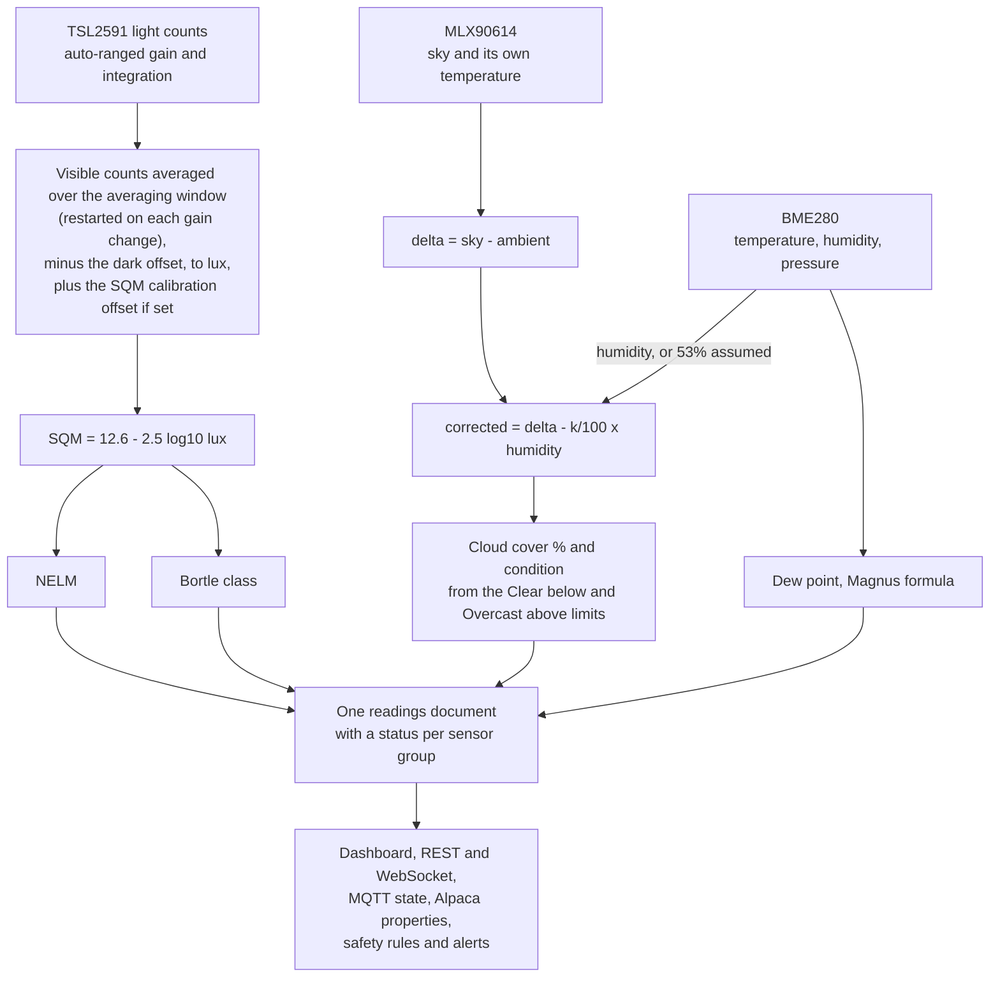

# Sky Quality Calculations

SQMeter converts TSL2591 light readings into three astronomical metrics. The conversion is only as good as the optical build and calibration: a bare TSL2591 is not a calibrated SQM instrument because it has a very wide angular response and can collect stray light from the horizon, ground, buildings, vehicles, and the enclosure.

<!-- diagram: DIA-05
sources: src/sensors/TSL2591Sensor.cpp#TSL2591Sensor::updateRollingReading lib/SkyLogic/src/ lib/DeviceCore/src/DeviceCore.cpp#derive lib/DeviceCore/src/DeviceCore.cpp#buildReadings src/sensors/BME280Sensor.cpp#BME280Sensor::calculateDewpoint
blocking: false
fingerprint: a6c2c579eca07de1
-->
<figure class="diagram" markdown>



<figcaption>From sensor readings to the one readings document every interface uses.</figcaption>
</figure>

??? info "Diagram in words"

    1. **Light**: the TSL2591 auto-ranges its gain and integration time.
        - Visible counts are averaged over the averaging window, the dark offset is subtracted, the result is converted to lux, and the SQM calibration offset is applied if one is set. This is the same in every mode; the average restarts whenever the gain or integration time changes, so it never mixes ranges.
        - Night mode (maximum gain and integration) is reported separately; it changes sensitivity, not the calculation.
    2. **Sky quality**: SQM = 12.6 - 2.5 × log₁₀(lux). NELM and the Bortle class are worked out from the SQM.
    3. **Cloud**: the MLX90614's sky temperature minus its own (ambient) temperature, corrected for humidity: corrected = delta - (k / 100) × humidity. The BME280's humidity is used, or 53 % when it isn't working. The corrected delta, against the **Clear below** and **Overcast above** limits, gives the cloud cover % and condition.
    4. **Dew point**: from the BME280's temperature and humidity (Magnus formula).
    5. Everything goes into **one readings document**, with a status per sensor group. The dashboard, REST and WebSocket, MQTT `<base>/state`, the Alpaca ObservingConditions properties, the safety rules and the alerts all use it, so they always agree.

---

## SQM — Sky Quality Meter

Measures sky brightness in magnitudes per square arcsecond (mag/arcsec²). Higher is darker.

```
SQM = 12.6 − 2.5 × log₁₀(lux)
```

Light below 0.0001 lux is treated as 0.0001 lux (SQM 22.6), the darkest the formula reports.

Firmware averages raw TSL2591 counts before this conversion, in every measurement mode: it applies a rolling average (restarted on each gain or integration change), subtracts the saved dark visible offset, then applies the optional SQM calibration offset. `sky.sqm` is the calibrated value and `sky.rawSqm` the uncalibrated one, so `sqm − rawSqm` equals the offset whenever calibration is on. Night mode (MAX gain, 600 ms integration) is when the reading is most sensitive.

To calibrate in **Settings → Sensors → Sky quality**: cover the sensor completely (lens cap or foil), wait until **Averaging window** shows the window full, then press **Calibrate dark**. The device refuses while the sensor still sees light or the window holds readings from before it was covered. **Averaging window** (10-300 s, default 90) and **Apply SQM offset** (±5 mag/arcsec², e.g. to match a reference SQM-L) are in the same card.

Dark calibration should be repeated whenever the lens, baffle, aperture, lens-to-sensor distance, or internal finish changes.

Typical values:

| Location | SQM |
|----------|-----|
| Excellent dark site | > 22 |
| Rural sky | ~21.5 |
| Suburban sky | ~19–20 |
| City centre | < 17 |

---

## NELM — Naked Eye Limiting Magnitude

The faintest star visible to the naked eye. SQMeter estimates it from SQM with Unihedron's formula:

```
NELM = 7.93 − 5 × log₁₀(10^(4.316 − SQM/5) + 1)
```

Below SQM 15 (twilight, indoors, city lights) NELM is reported as 0 - no stars visible. Higher = more stars visible. A dark rural sky gives NELM ≈ 6.5. Suburban skies typically give 4–5.

---

## Bortle Dark Sky Scale

Each class starts at its lower bound (inclusive): SQM 21.99 is class 1, 21.98 class 2.

| Class | SQM | Description |
|-------|-----------|-------------|
| 1 | ≥ 21.99 | Excellent dark-sky site |
| 2 | 21.89 – < 21.99 | Typical truly dark site |
| 3 | 21.69 – < 21.89 | Rural sky |
| 4 | 20.49 – < 21.69 | Rural/suburban transition |
| 5 | 19.50 – < 20.49 | Suburban sky |
| 6 | 18.94 – < 19.50 | Bright suburban sky |
| 7 | 18.38 – < 18.94 | Suburban/urban transition |
| 8 | 17.00 – < 18.38 | City sky |
| 9 | < 17.00 | Inner-city sky |

---

## Cloud Detection (MLX90614)

When an MLX90614 IR thermometer is present, SQMeter estimates cloud cover by comparing sky IR temperature to ambient temperature. A large negative delta (sky much colder than ambient) indicates clear sky. A small delta indicates cloud cover blocking the sky's thermal emission.

Humid air radiates more, making a clear sky look warmer, so the delta is corrected for humidity before it's classified:

```
delta     = sky temperature − ambient temperature
corrected = delta − (k / 100) × humidity          (humidity clamped to 0–100 %)
```

| Corrected delta | Condition | Cloud cover |
|---|---|---|
| below **Clear below** (default −13 °C) | Clear | 0 % |
| from Clear below up to **Overcast above** (default −3 °C) | Cloudy | linear 0 → 100 % |
| at or above Overcast above | Overcast | 100 % |

`k` is **Humidity correction** (default 0.75). All three are in **Settings → Sensors → Cloud detection**.

Humidity comes from the BME280. Without a working BME280 the model assumes **53 %** and says so: `clouds.humiditySource` is `assumed` in the readings, and the safety verdict counts the environment sensor as faulted. Alpaca's Humidity property never reports the assumed value.

This is a heuristic and works best in dry climates; fog and haze affect it. The model is computed once per reading, so the dashboard, MQTT, Alpaca and the safety verdict always agree.

The dew point is the Magnus formula (a = 17.27, b = 237.7 °C).

---

## Implementation

`lib/SkyLogic` - `SkyQuality.cpp`, `CloudDetection.cpp` and `Dewpoint.cpp` - with native tests in `test/test_sky_logic`.
