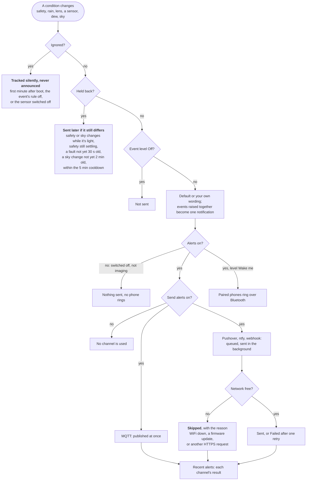

# Alerts

SQMeter can send push notifications itself - over Pushover, ntfy, a webhook, or MQTT - so you hear about rain or a safety change even when N.I.N.A. and the observatory PC aren't running.

Configure everything in **Settings → Alerts**: turn on **Send alerts** (the master switch for every channel), pick your channels, **Save**, then use **Send test** next to each channel. With **Send alerts** off nothing is sent to any channel, though Bluetooth phone alarms still ring (see [Bluetooth](ble.md)).

<!-- diagram: DIA-06
sources: lib/AlertLogic/src/AlertEngine.cpp lib/DeviceCore/src/DeviceCore.cpp#runAlerts src/WebServer.cpp#WebServer::processAlerts src/AlertDispatcher.cpp#AlertDispatcher::dispatch src/AlertDispatcher.cpp#AlertDispatcher::deliver
blocking: false
fingerprint: 03686090d18b238c
-->
<figure class="diagram" markdown>



<figcaption>Why an alert does or doesn't arrive: every gate a change passes on its way to your channels.</figcaption>
</figure>

??? info "Diagram in words"

    1. The device compares every condition (the safety verdict, rain, the rain sensor's lens, each sensor, dew risk, the sky) with what you were last told, every second.
    2. **Tracked silently, never announced**: changes in the first minute after boot, changes while that event's rule is switched off, and anything from a sensor that is switched off.
    3. **Held back for now, sent later if still true**:
        - safe/unsafe while it's light (with "Safety alerts only when it's dark"), or while the verdict is still settling (no data yet, or waiting out the safe delay);
        - sky changes while it's light (with sky alerts limited to darkness): at nightfall a clear sky is announced once;
        - a sensor fault or recovery not yet 30 seconds old;
        - a sky change not yet 2 minutes old;
        - within the 5-minute cooldown since that condition's last alert.
    4. **Not sent**: an event whose level is Off.
    5. The alert gets its default or custom wording; events raised in the same second become one notification.
    6. **Alerts switched off** (not imaging): nothing is sent and no phone rings.
    7. With alerts on:
        - a **Wake me** alert rings paired phones over Bluetooth, even with **Send alerts** off;
        - with **Send alerts** on, it goes to every enabled channel: MQTT at once; Pushover, ntfy and the webhook in the background.
    8. A background send is **skipped** when WiFi is down, a firmware update is running or another HTTPS request holds the connection; otherwise it is **sent**, or **failed** after one retry on a connection error.
    9. Each channel's result appears under **Recent alerts**.

---

## Events

Every event has its own **level**, and with Pushover on, its own **sound**:

| Event | When | Default level |
|---|---|---|
| It turns unsafe / safe again | The SafetyMonitor verdict changes (after the safe delay). Unsafe alerts list the reasons | Urgent / Normal |
| Rain starts / stops | The RG-15 starts reporting rain / the rain clear delay passes with no rain | Wake me / Normal |
| A sensor fails / recovers | A sensor (TSL2591, MLX90614, BME280, RG-15) goes offline or stale, or recovers. Also the RG-15 lens-fault flag | Wake me / Quiet |
| Dew risk | Temperature comes within the configured margin of the dew point | Off |
| Skies clear up / cloud over | Cloud cover drops below the "clear" percentage (default 20%) / rises above the "clouded over" percentage (default 70%). Between the two nothing changes, and a change has to hold for 2 minutes | Off |
| The imaging app stops checking / is back | No request reached the safety monitor or weather device for its **Silent for** time / it started checking again. See [The imaging app](#the-imaging-app) | Urgent / Quiet |
| The imaging app disconnects | An imaging app disconnected normally, e.g. at the end of a session | Off |

| Level | Pushover | ntfy | Bluetooth phone alarm |
|---|---|---|---|
| Off | not sent | not sent | - |
| Quiet | priority -1, no sound | `low` | - |
| Normal | priority 0 | `default` | - |
| Urgent | priority 1, bypasses quiet hours | `high` | - |
| Wake me | priority 2 (emergency): repeats every minute for up to an hour until acknowledged | `max` | rings paired phones |

**Test** on an event row sends a sample of that event ("Test: Clouded over") to every enabled channel at the level and sound currently picked - no need to save first - and shows each channel's result. A Wake me test also rings paired phones, and a Pushover emergency test keeps repeating until you acknowledge it in the app.

So "skies cloud over" can be Wake me with a loud sound while "skies clear up" stays Normal, and dew risk can be Quiet. A sound left on **Default** uses the Pushover channel's default sound. Webhook and MQTT payloads carry the level as `"level": "quiet" | "normal" | "urgent" | "wake"`.

### Why it's unsafe

An unsafe alert lists every failing rule with the reading and your limit, one per line:

```
Observatory UNSAFE
• SQM 18.21 < 19.50
• Cloud 62% >= 35%
• Humidity 92% > 90%
```

The same wording shows on the dashboard's safety card and in `GET /api/safety`.

### Several at once

Alerts raised at the same moment - rain starting usually makes the observatory unsafe too - arrive as one notification ("Rain detected · Observatory UNSAFE") at the loudest of their levels, using that event's sound. Webhook and MQTT payloads then also carry `"events": ["rain_started", "unsafe"]`.

### Your own wording

**Text** on an event row lets you write the title and message yourself. Click a `{variable}` to insert it at the cursor; anything left empty keeps the built-in wording, shown greyed out. **Test** sends your wording filled in with the current readings, before you save.

| Variable | Value |
|---|---|
| `{reasons}`, `{reasons_inline}`, `{reason_count}` | Unsafe only: each failing rule with value and limit (one per line / on one line), and how many |
| `{sensor}` | Sensor events: which sensor |
| `{event}` | The event name, as in webhook payloads: `unsafe`, `rain_started`, ... |
| `{device}`, `{time}`, `{date}`, `{level}` | Device name, local time and date, alert level |
| `{sqm}`, `{cloud}`, `{sky_temp}`, `{temp}`, `{humidity}`, `{dewpoint}`, `{dew_margin}`, `{pressure}`, `{rain_rate}`, `{wind}`, `{gust}`, `{sun_alt}` | Current readings (`--` if that sensor isn't reporting) |
| `{sqm_min}`, `{cloud_max}`, `{humidity_max}` | Your safety limits |
| `{clear_below}`, `{cloudy_above}`, `{dew_margin_min}` | Your alert thresholds |
| `{silent_for}`, `{last_checked}`, `{client_id}` | Imaging-app events: the **Silent for** time ("2 min"), when the app last checked ("21:04", or "3 min ago" without a clock) and the Alpaca ClientID it sent. For these events `{device}` is "safety monitor" or "weather device" |

Titles are up to 80 characters and messages up to 240. An unknown `{name}` is left as typed, so a typo shows up in the test.

**Cooldown** (default 5 min) is the minimum time between alerts of the same kind, so a flapping condition doesn't spam you. A change held back by the cooldown isn't lost: if the condition still differs from what you were last told when the cooldown ends, that alert is sent then - the most recent alert always matches reality.

### Restarts

While the device starts up it reports unsafe (no data yet, then the safe delay, which also runs from boot). None of that is announced. Once the first minute is over, the verdict is compared with the last safe/unsafe alert actually sent before the restart: if it was "unsafe" and it's still unsafe, you hear nothing; if it changed, you get the alert. The safe delay at the end of a real unsafe spell isn't news either - you hear "unsafe" when it starts and "safe" once the delay is over.

**History** on the dashboard's safety card lists the last 32 safety changes, restarts (and why the device restarted) and the safe/unsafe alerts actually sent. It survives restarts, crashes and updates, but not a power cut - so when an alert seems missing, it shows whether the device restarted, was only waiting out the safe delay, or held the alert back for the cooldown.

Nothing is sent in the first minute after boot, so a restart doesn't announce the device's startup state. Sensor faults and recoveries must also last 30 seconds before they're sent, so brief blips (saving settings, a sensor being reconfigured, an OTA upload) don't page anyone.

---

### Only when it's dark

**Safety alerts only when it's dark** (on by default) does the same for safe/unsafe: at dawn the brightening sky fails the SQM rule, and without this you'd be woken by "Observatory UNSAFE: SQM 17.24 < 17.25" every clear morning. While it's light, changes aren't announced; at nightfall the verdict is compared with the last safe/unsafe alert, so you hear "unsafe" if it's dark but cloudy and nothing if nothing changed. Rain and sensor alerts are separate events and still come at any time. N.I.N.A. still sees the real verdict all day.


Sky alerts are limited to darkness by default: **after sunset**, **nautical dark** (sun 12° below the horizon, the default) or **astronomical dark** (18°). Darkness comes from the sun's position, so the device needs to know where it is - a GPS fix if there is one, otherwise the coordinates under **Settings → Time & Location → Location** (paste "latitude, longitude" from any maps app). If the sky is already clear when it gets dark, you get one "Dark and clear" alert (titled "Skies clear" when sky alerts aren't limited to darkness). Without a clock or a location, sky alerts aren't held back.

Below the setting, the tab shows the sun's altitude as the device calculates it - the same number it decides by - and when the chosen darkness starts and ends tonight, predicted in the browser from the same location and shown in the browser's time zone.

The browser's own location can't be used on the device's plain-HTTP pages - browsers only share it with HTTPS sites - so the "Use my location" button only appears where it works.

## When to send

With the scope packed away you don't want weather flapping to wake you. **Settings → Alerts → When to send** has two choices:

| When to send | What happens |
|---|---|
| **Any time** (default) | Alerts go out whenever something happens, unless you pause them. |
| **Only while an imaging app is connected** | Alerts start when an imaging app (e.g. N.I.N.A.) connects the safety monitor or weather device, and stop when it disconnects. If it stops responding without disconnecting, alerts keep coming - and you're told it went quiet. |

Under it, a status line says what's happening and why, for example:

- "Sending alerts."
- "Paused - the imaging app disconnected at 05:42. Alerts resume when it connects again."
- "Paused by you at 21:04 (Pause button)."
- "Paused from Home Assistant or MQTT at 21:04."
- "Waiting for an imaging app to connect - nothing is sent until then."

**Pause alerts** / **Resume alerts** (there, or in the bell's flyout) take effect straight away, in either mode. A pause lasts until you resume; with **Only while an imaging app is connected** the next connect also resumes. While paused nothing is sent and phones don't ring, but the device keeps watching, so resuming doesn't replay stale changes. The state survives restarts. Resuming sends one quiet **Alerts resumed** with the current verdict ("Observatory UNSAFE: • Cloud 62% >= 35%") so you know where things stand.

A crash isn't the end of a session: an imaging app that goes silent doesn't pause alerts - that's exactly when weather alerts matter most. Only a clean disconnect does.

### The imaging app

The device notices when an imaging app - anything that talks to its Alpaca devices - stops checking:

- **The imaging app stops checking**: a device had a client (connected, or polling since the device restarted) and no request has reached it for its **Silent for** time - the PC slept, the app crashed or the network dropped. Sent once per loss, at Urgent by default.
- **The imaging app is back**: the first request after that. Quiet by default.
- **The imaging app disconnects**: a normal disconnect, e.g. at the end of a session. Off by default; no "stops checking" follows it.

**Silent for** is set per device: **safety monitor** (default 2 min - imaging apps check it every few seconds) and **weather device** (default 10 min - keep it longer than your app's weather interval). 30 seconds to 60 minutes.

Nothing is sent about a device no app has used since the device restarted. Requests from the device's own web page (the Alpaca page's live state) don't count. Alpaca requests don't name the application, so alerts name the device, not the app. The Alpaca page shows each device's state ("Connected, last checked 3 s ago"). These events need Alpaca switched on, and are sent at any hour (the "only when it's dark" limits don't apply).

### Automating pause and resume

**N.I.N.A.** - choose **Only while an imaging app is connected**, or call the API from a sequence (e.g. an *External Script* instruction): `curl -X POST http://sqmeter.local/api/alerts/arm` to resume at the start, `.../api/alerts/disarm` to pause at the end.

**Home Assistant (MQTT)** - with [MQTT discovery](mqtt.md#home-assistant) on, an *Alerts* switch appears automatically (on = sending, off = paused). Without it, the device publishes `<base>/alerts/armed` (retained `1` sending / `0` paused) and listens on `<base>/alerts/armed/set` (`1`/`0`, `on`/`off`, `true`/`false`):

```yaml
mqtt:
  switch:
    - name: "SQMeter alerts"
      state_topic: "sqmeter/alerts/armed"
      command_topic: "sqmeter/alerts/armed/set"
      payload_on: "1"
      payload_off: "0"
      icon: mdi:bell-ring
```

**Home Assistant (REST)**:

```yaml
rest_command:
  sqmeter_alerts_on:
    url: "http://sqmeter.local/api/alerts/arm"
    method: post
  sqmeter_alerts_off:
    url: "http://sqmeter.local/api/alerts/disarm"
    method: post
```

Add `username`/`password` if the device's password protection is on. N.I.N.A. and Alpaca keep getting the real safety verdict either way. `GET /api/alerts/armed` says whether alerts are being sent, the mode, and why ([REST API](../api/rest.md#get-apialertsarmed-post-apialertsarm-post-apialertsdisarm)).

## Channels

### Pushover

1. Create an application at [pushover.net](https://pushover.net/apps/build) and copy its API token - it goes in **App token**
2. Copy your **user key** from the Pushover dashboard
3. Enable **Pushover**, paste both, optionally pick a default sound, **Save**, **Send test**

### ntfy

Enable **ntfy** and set a topic. The server defaults to `https://ntfy.sh`; use your own server's URL if you self-host, plus an access token if it requires one. Topics on ntfy.sh are public - choose a long, unguessable topic name, then subscribe to it in the ntfy app.

### Webhook

POSTs a JSON body to any `http://` or `https://` URL - e.g. a Home Assistant webhook trigger, Node-RED, or a relay to Discord/Slack:

```json
{"device":"SQM-ESP32","event":"rain_started","title":"Rain detected","message":"The rain sensor reports rain (2.4 mm/h).","level":"wake","timestamp":1759500000}
```

`event` is one of `unsafe`, `safe`, `rain_started`, `rain_stopped`, `sensor_fault`, `sensor_recovered`, `lens_fault`, `dew_risk`, `clear_sky`, `clouded_over`, `test`. An optional **Authorization header** value is sent as-is (e.g. `Bearer <token>`).

HTTPS webhooks are verified against a built-in set of common root CAs (Let's Encrypt, DigiCert, Sectigo/USERTrust, Google Trust Services, Amazon). For a self-signed server on your own network, either use `http://` or turn on **Skip certificate checks** - only do that on a network you trust.

### MQTT

Uses the broker from the MQTT settings. Publishes:

- `<base>/alerts` - each alert as JSON (`event`, `events` when several are stacked, `title`, `message`, `level`, `device`, `timestamp`), not retained

The safe/unsafe flag (`<base>/safe`, `<base>/safety`) is published whenever MQTT is on - see [MQTT](mqtt.md#topics).

---

## Recent alerts

**Clear** in the flyout empties the list on the device.

While alerts are on, a bell in the header shows how many alerts arrived since you last looked, and opens the last 20 alerts since boot with each channel's delivery status (`sent`, `failed` with the reason, or `skipped` - e.g. no WiFi, or an OTA update in progress). **Send test** waits for that status and shows the actual result. The list is also available from `GET /api/alerts/recent`.

## Pushover keys

The **user key** is the 30-character key at the top of your Pushover dashboard; the **app token** is the 30-character API token of an application you create there. Settings rejects anything else - a pasted email address, or the token in the user field, is the usual cause of Pushover's "user identifier is not a valid user" error.
