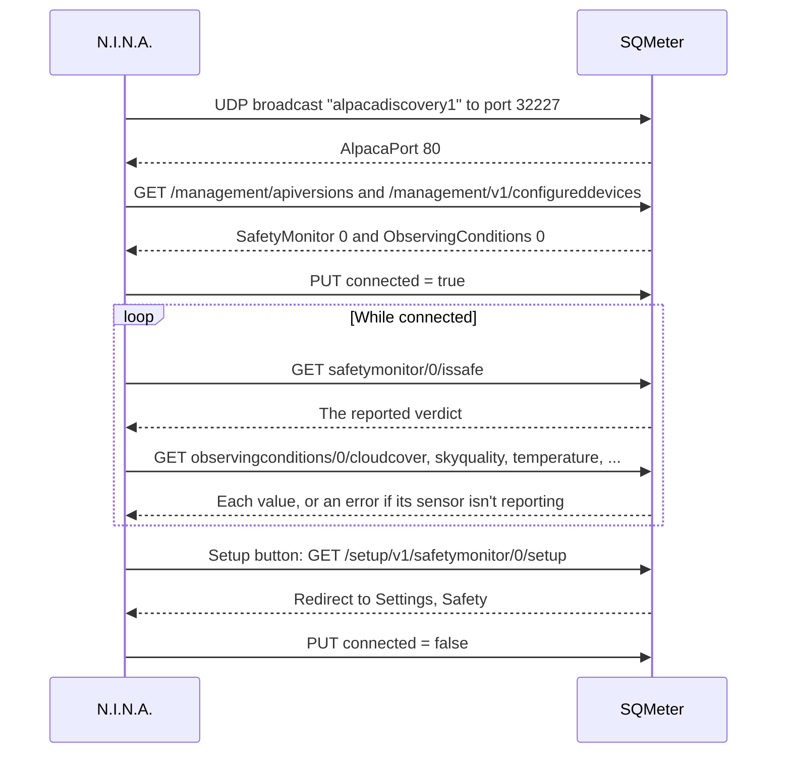
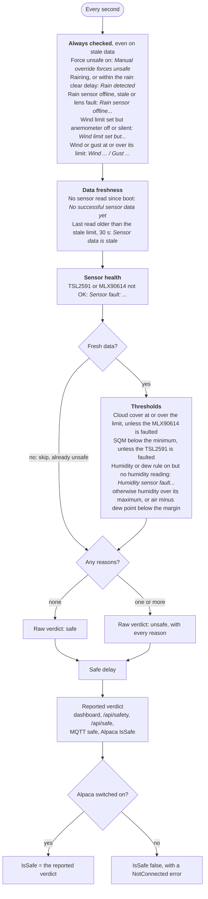

```mermaid
stateDiagram-v2
    accTitle: The safe delay
    accDescr: Unsafe is reported at once. When the raw verdict turns safe the device waits for the safe delay, reporting unsafe meanwhile; any failing rule during the wait restarts it from zero.
    state "Reported unsafe" as Unsafe
    state "Waiting: raw safe, reported unsafe" as Waiting
    state "Reported safe" as Safe
    [*] --> Unsafe: device starts
    Unsafe --> Waiting: every rule passes
    Waiting --> Unsafe: a rule fails, the countdown resets
    Waiting --> Safe: safe for the whole delay
    Safe --> Unsafe: a rule fails, reported at once
```

# ASCOM Alpaca

SQMeter can act as an ASCOM Alpaca **SafetyMonitor** and **ObservingConditions** device directly - no separate bridge/service needed. N.I.N.A. and other ASCOM Alpaca clients connect straight to the device's IP address.

!!! note "Replaces the standalone bridge"
    Earlier setups used a separate `SQMeter-ASCOM-Alpaca` Windows service/`.exe` that polled the device's REST API and re-served it as Alpaca. That bridge still works, but is no longer necessary - the device now speaks Alpaca natively. If you're migrating from it, disconnect N.I.N.A. from the bridge's devices first, then follow this guide to connect directly to the device instead.

---

## Enabling Alpaca support

1. Open the web UI and go to **Settings → Safety**
2. In the **ASCOM Alpaca** card, turn on **Serve Alpaca devices**
3. Set your safety rules (see [Safety rules](#safety-rules) below) and **Save**
4. When asked, restart the device: the UDP discovery listener that N.I.N.A. uses to find the device only starts at boot

Alpaca support is disabled by default. With it off, every Alpaca endpoint still responds (so tooling doesn't 404) but reports `connected: false` and a `NotConnected` error - it just isn't discoverable or usable until enabled.

!!! note "Upgrading from an earlier firmware"
    Device `UniqueID`s now include the board's MAC address (e.g. `sqmeter-a1b2c3d4e5f6-safetymonitor-0`) so two SQMeters on the same network never collide. If N.I.N.A. was already connected to a previous firmware, re-select both devices once after upgrading.

---

## Connecting from N.I.N.A.

<!-- diagram: DIA-10
sources: lib/AlpacaLogic/src/AlpacaDiscovery.cpp lib/AlpacaLogic/src/AlpacaRouter.cpp src/WebServer.cpp#WebServer::setupAlpacaRoutes
blocking: false
fingerprint: 46c4937e5bf581c8
-->
<figure class="diagram" markdown>



<figcaption>N.I.N.A. and SQMeter over Alpaca: discovery, connecting, polling and the Setup button.</figcaption>
</figure>

??? info "Diagram in words"

    1. N.I.N.A. broadcasts `alpacadiscovery1` on UDP port 32227. SQMeter answers `{"AlpacaPort": 80}` - only when **Serve Alpaca devices** was on when it started, since the listener starts at boot.
    2. N.I.N.A. asks the management API (`/management/apiversions`, `/management/v1/configureddevices`) and gets **SafetyMonitor 0** and **ObservingConditions 0**.
    3. Connecting sends `PUT .../connected` with `Connected=true`.
    4. While connected, N.I.N.A. polls `safetymonitor/0/issafe` (the reported verdict, after the safe delay) and the ObservingConditions properties; a property whose sensor isn't reporting returns an error instead of a value.
    5. The Setup button opens `/setup/v1/<device>/0/setup`, which redirects to **Settings → Safety** in the web UI.
    6. Disconnecting sends `Connected=false`.
    7. With Alpaca switched off, every endpoint still answers but reports not connected, and `IsSafe` returns false with a NotConnected error.

### SafetyMonitor

1. Equipment → **Safety Monitor** → select **ASCOM Alpaca**
2. Click **Refresh** - N.I.N.A. broadcasts a UDP discovery request on port `32227`; SQMeter responds and N.I.N.A. lists **SQMeter SafetyMonitor**
3. Select it and click **Connect**

### ObservingConditions

1. Equipment → **Weather** (Observing Conditions) → select **ASCOM Alpaca**
2. Click **Refresh**, select **SQMeter ObservingConditions**, **Connect**

Both devices are served from the same device/port - connecting one doesn't require or block the other.

### Alpaca page

The web UI's **Alpaca** tab lists every advertised device with its device type, number, `UniqueID`, setup page, API base URL and live `DeviceState` (refreshed every 5 s), plus the host/port to use when adding the device manually. Use it to confirm what N.I.N.A. should see without leaving the browser.

### Setup button

The **Setup** (cog) button next to either device in N.I.N.A. opens `http://<device>/setup/v1/<devicetype>/0/setup`, which redirects to **Settings → Safety** (the ASCOM Alpaca card and safety rules) in the web UI. Rules changed there apply as soon as you save.

### If discovery doesn't find the device

- Confirm **Serve Alpaca devices** is on under **Settings → Safety → ASCOM Alpaca** and the device has been restarted since
- Discovery is a UDP broadcast - it won't cross VLANs/subnets or most VPNs; N.I.N.A. and the device need to be on the same local network segment
- As a fallback, most Alpaca clients (including N.I.N.A.) let you add a device manually by IP:port instead of relying on discovery - use the device's IP and port `80`

---

## Safety rules

The safety verdict is re-evaluated every second from the current sensor readings against the rules in **Settings → Safety → Safety rules**. It is shown on the Dashboard's **Safety Monitor** card, on the **Alpaca** page, from `GET /api/safety`, and served to Alpaca clients as `SafetyMonitor.IsSafe`. Any of the following makes it unsafe:

1. **Manual override** - the **Force unsafe** toggle is on
2. **Rain** - the RG-15 reports rain, *or* it rained within the rain sensor's "rain clear delay" (default 15 min; see [the rain latch](../hardware/rg15.md#the-rain-latch)). Enabled by default whenever the rain sensor is enabled
3. **Rain sensor offline/faulty** - the rain sensor is enabled but not responding, its data is stale, or it reports a lens fault (fail safe; enabled by default)
4. **Wind / gust** - the 2-minute mean wind speed or the 10-minute peak gust is at or above its limit (both disabled by default). If a wind limit is enabled but the [anemometer](../hardware/wind.md) is disabled or not reporting, that's unsafe too
5. **No data yet** - the device hasn't completed a sensor read since boot
6. **Stale data** - the last successful read is older than the stale-data threshold (default 30s)
7. **Sensor fault** - the light sensor (TSL2591) or IR temperature sensor (MLX90614) is reporting a non-OK status
8. **Cloud cover** - at or above the configured threshold (default 90%, if enabled)
9. **Sky brightness (SQM)** - below the configured minimum (disabled by default)
10. **Humidity** - above the configured maximum (disabled by default)
11. **Temperature-dewpoint margin** - below the configured minimum (disabled by default)
12. **Humidity sensor fault** - the humidity or dew-point rule is enabled but the BME280 isn't reporting, so it can't be evaluated

Rain and wind rules (2-4) are checked even when the other sensors' data is stale or missing - nothing should hide the fact that it's raining or blowing a gale. Rules 8-12 only apply to fresh data.

Each threshold has its own enable/disable toggle - a disabled threshold never contributes to the verdict.

<!-- diagram: DIA-02
sources: lib/AlpacaLogic/src/SafetyEvaluator.cpp#evaluateSafety lib/DeviceCore/src/DeviceCore.cpp#safetyInputs lib/DeviceCore/src/DeviceCore.cpp#safetyThresholds lib/AlpacaLogic/include/AlpacaRouter.h
blocking: true
fingerprint: b381debde3c387b1
-->
<figure class="diagram" markdown>



<figcaption>How the safety verdict is decided. Each rule only counts when it's switched on; every failing rule adds its reason.</figcaption>
</figure>

??? info "Diagram in words"

    Every second the device checks all enabled rules and collects a reason for each one that fails:

    1. **Always checked**, even when the other data is stale or missing:
        - Force unsafe is on: "Manual override forces unsafe".
        - The rain sensor reports rain, or rain within the rain clear delay: "Rain detected".
        - The rain sensor is enabled but offline, stale or reporting a lens fault: "Rain sensor offline, stale or reporting a lens fault".
        - A wind limit is set but the anemometer is disabled or not reporting: "Wind limit set but the anemometer is disabled or not reporting". Otherwise wind or gust at or over its limit: "Wind ..." / "Gust ...".
    2. **Data freshness**: no sensor read since boot gives "No successful sensor data yet"; the last read older than the stale limit (default 30 s) gives "Sensor data is stale".
    3. **Sensor health**: the TSL2591 or MLX90614 not OK gives "Sensor fault: ..." naming which.
    4. **Only with fresh data**, the threshold rules:
        - cloud cover at or over its limit (skipped if the MLX90614 is faulted);
        - SQM below its minimum (skipped if the TSL2591 is faulted);
        - if the humidity or dew-point rule is on but there's no humidity reading, "Humidity sensor fault"; otherwise humidity above its maximum, or air temperature minus dew point below the margin.
    5. No reasons: the raw verdict is safe. Any reason: unsafe, with all the reasons.
    6. The raw verdict passes through the [safe delay](#safe-delay), and the result is what the dashboard, `/api/safety`, `/api/safe`, MQTT `<base>/safe` and Alpaca `IsSafe` report.
    7. With Alpaca switched off, `IsSafe` returns false with a NotConnected error instead (see [Connecting from N.I.N.A.](#connecting-from-nina)).

### Reasons

Every failing rule is listed as a reason with the measured value and the limit, e.g. `SQM 18.70 < 19.50` or `Cloud 96% >= 90%`. The reasons are shown on the Dashboard's **Safety Monitor** card, returned by `GET /api/safety`, published to MQTT `<base>/safety`, and used in alert messages (`{reasons}`).

The Safety Monitor card's **History** lists recent safe/unsafe changes, restarts and the safety alerts that were sent - kept across restarts (not power cuts) - which answers "it went unsafe and I got no alert: why?".

### Safe delay

**Safe delay** (seconds, default `0`) holds a "safe" verdict back until conditions have been continuously safe for that long, so a brief gap in the clouds doesn't reopen the roof. Unsafe is always reported immediately, and the delay also applies after a reboot. While the delay is running, the Safety Monitor card shows "Safe in Ns".

<!-- diagram: DIA-03
sources: lib/AlpacaLogic/src/SafetyEvaluator.cpp#SafeDelayFilter::update lib/DeviceCore/src/DeviceCore.cpp#updateSafety
blocking: true
fingerprint: 9677b24322801cdf
-->
<figure class="diagram" markdown>



<figcaption>The safe delay. The raw verdict and the reported verdict differ only while waiting; with a delay of 0 there's no wait.</figcaption>
</figure>

??? info "Diagram in words"

    - The device starts reporting **unsafe** (it has no data yet, and the countdown only starts once the rules pass).
    - When every rule passes, the raw verdict is safe and the countdown starts. The device still reports **unsafe**; `/api/safety` shows `rawSafe: true` and `secondsUntilSafe`, and the dashboard shows "Safe in Ns".
    - If any rule fails during the wait, the device stays unsafe and the countdown starts again from zero the next time every rule passes.
    - After the raw verdict has been safe for the whole delay, the device reports **safe**. With a delay of 0 this happens immediately.
    - From safe, any failing rule is reported as **unsafe at once** - unsafe is never delayed.

---

## ObservingConditions properties

| Alpaca property | Source |
|---|---|
| `cloudcover` | Cloud detection (IR sky temperature vs. ambient, humidity-corrected) |
| `dewpoint` | BME280 |
| `humidity` | BME280 |
| `pressure` | BME280 (hPa, station level) |
| `rainrate` | Hydreon RG-15 rain intensity, in mm/h (converted if the RG-15 reports inches). `NotImplemented` when the rain sensor is disabled in Settings |
| `skybrightness` | TSL2591 lux |
| `skyquality` | Calculated SQM (mag/arcsec²) |
| `skytemperature` | MLX90614 IR object temperature |
| `temperature` | BME280 |
| `averageperiod` | Always `0`. `PUT` accepts only `0`; other values return `InvalidValue` (`0x401`) |
| `windspeed` | Anemometer, 2-minute mean in m/s ([wiring](../hardware/wind.md)). `NotImplemented` when the anemometer is disabled |
| `windgust` | Anemometer, highest 3-second mean in the last 10 minutes, m/s |
| `winddirection` | Wind vane, degrees clockwise from north (`0` when calm). `NotImplemented` when no vane is enabled |
| `starfwhm` | Never implemented. Star FWHM needs a camera imaging real stars; N.I.N.A. measures HFR from your own frames |

Each property is tied to the sensor that produces it, so a fault in one sensor (say the BME280) only makes *its* properties return a driver error (`0x500`) - the others keep reporting. A stale or never-read sensor is treated the same way.

`sensordescription` and `timesincelastupdate` take a `SensorName` (any property name above) and report which sensor serves it and how many seconds ago it last updated; an empty `SensorName` to `timesincelastupdate` returns the age of the most recent update from any sensor. `PUT refresh` is accepted and does nothing - readings already refresh every sensor cycle.

---

## Conformance testing

The Alpaca API is implemented once, in `lib/AlpacaLogic` (`Alpaca::Router`), and used by both the firmware and a small desktop simulator, `tools/alpaca-sim`, which serves it with fixed, healthy sensor readings. Every pull request that touches it runs [ASCOM ConformU](https://github.com/ASCOMInitiative/ConformU) against the simulator - full conformance and the Alpaca protocol check, for both devices - and fails on any error, issue or configuration alert. The logs are attached to the run as `conformu-results`.

To run it yourself (Linux or macOS):

```bash
tools/alpaca-sim/build.sh
./alpaca-sim 11111
conformu conformance http://127.0.0.1:11111/api/v1/observingconditions/0
conformu alpacaprotocol http://127.0.0.1:11111/api/v1/safetymonitor/0
```

To test a real device, point ConformU at `http://<device-ip>:80/api/v1/<safetymonitor|observingconditions>/0`.

## Reference

See the [REST API reference](../api/rest.md#ascom-alpaca-api) for the full endpoint list and the [ASCOM Alpaca API spec](https://ascom-standards.org/api/) for the response envelope and standard error codes.
