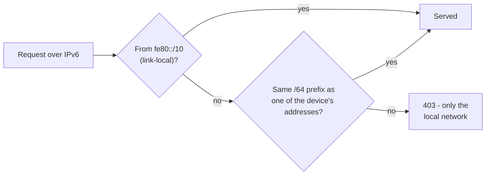

# IPv6

SQMeter works on IPv6 alongside IPv4 ("dual stack"). On a network that offers IPv6 - most home
routers do - the device gets IPv6 addresses of its own, and you can reach the web UI, the API,
live updates and N.I.N.A. over either protocol.

IPv4 always keeps working. A network without IPv4 (IPv6-only) isn't supported yet.

---

## Turning it on or off

**Settings → Network → WiFi → IPv6** (on by default). It applies after a restart. With it off,
the device behaves exactly as an IPv4-only device: no IPv6 addresses, nothing advertised over
IPv6.

Turn it off if IPv6 on your network misbehaves, or you simply don't want it.

---

## The device's addresses

**System → WiFi** lists each IPv6 address with its kind:

| Shown as | Address | Meaning |
|---|---|---|
| link-local | `fe80::...` | Always present while IPv6 is on. Works on the local network only; your computer may need the interface (`fe80::...%en0`). |
| local | `fd..::...` | A unique-local address, when your router hands out a private IPv6 prefix. |
| global | `2a02:...`, `2001:...` | A normal IPv6 address from your internet provider's prefix. |

The device picks these up by itself (SLAAC) from your router's announcements; there's nothing to
configure. When the provider changes the prefix the device follows. The same list is in
[`GET /api/status`](../api/rest.md#get-apistatus) as `wifi.ipv6`.

---

## Reaching the device over IPv6

- **By name**: with mDNS on, `http://sqmeter.local` answers with both the IPv4 and the IPv6
  addresses (A and AAAA records), so your computer can use either.
- **By address**: put IPv6 addresses in brackets in a browser or URL -
  `http://[2a02:8010:abcd:1::9]/`. From a terminal: `curl -g "http://[2a02:8010:abcd:1::9]/api/status"`.
- **N.I.N.A. / Alpaca**: discovery also answers on the Alpaca IPv6 discovery group
  (`ff12::a1:2345`, port 32227), so clients that discover over IPv6 find the device too.

<!-- diagram: DIA-16
sources: lib/NetAddress/ src/Ipv6Network.cpp
blocking: true
fingerprint: fc19154308f2113e
-->
<figure class="diagram" markdown>

<figcaption>Who can reach SQMeter over IPv6: link-local and the device's own prefixes, nobody else.</figcaption>
</figure>

??? info "Diagram in words"

    A request that arrives over IPv6 is served if it comes from a link-local address (`fe80::/10`),
    or from an address with the same /64 prefix as one of the device's own addresses. Anything else
    gets `403`. Requests over IPv4 aren't affected.

### Only from your local network

A global IPv6 address is, in principle, reachable from the internet if the router allows it. So
over IPv6 the device only accepts requests from link-local addresses and from addresses in its own
network prefixes; anything else gets `403 IPv6 requests are only accepted from the local network`.
That covers the web UI, the API, WebSockets and Alpaca. IPv4 is unchanged.

This is a backstop, not a reason to expose the device: it still has no TLS, so keep it behind your
router's firewall and use a VPN for remote access ([Security](security.md)).

---

## Outbound connections

| Service | Over IPv6 |
|---|---|
| MQTT broker | Yes - an IPv6 address (`fd00::10`, or `[fd00::10]:1883` to give the port there) or a name that only has an IPv6 address |
| Webhook (`http://`) | Yes - `http://[fd00::10]:8080/hook` or a name that only has an IPv6 address |
| Webhook (`https://`), Pushover, ntfy, GitHub update checks, NTP | IPv4 for now |

Names with both kinds of address are reached over IPv4, so a broken IPv6 connection upstream never
delays MQTT, alerts or updates. The secure (https) clients on the current firmware platform only
speak IPv4; they move to IPv6 with a later platform upgrade. All of those services are reachable
over IPv4 today, so nothing stops working.

Settings check IPv6 addresses the same way in the browser and on the device:

| You type | Result |
|---|---|
| `fd00::10` or `[fd00::10]` | IPv6 broker on the Port field's port |
| `[fd00::10]:1883` | IPv6 broker on port 1883 |
| `broker.local:1883` | "Put the port in the Port field" |
| `fe80::1%wlan0` | "Leave out the %zone - the device has one network interface" |
| `https://[fd00::10]/hook` | "https to an IPv6 address isn't supported yet - use a host name, or http" |

---

## The setup hotspot

The `SQM-Setup` hotspot stays IPv4-only - phones join it with IPv4. IPv6 starts once the device
is on your network.
