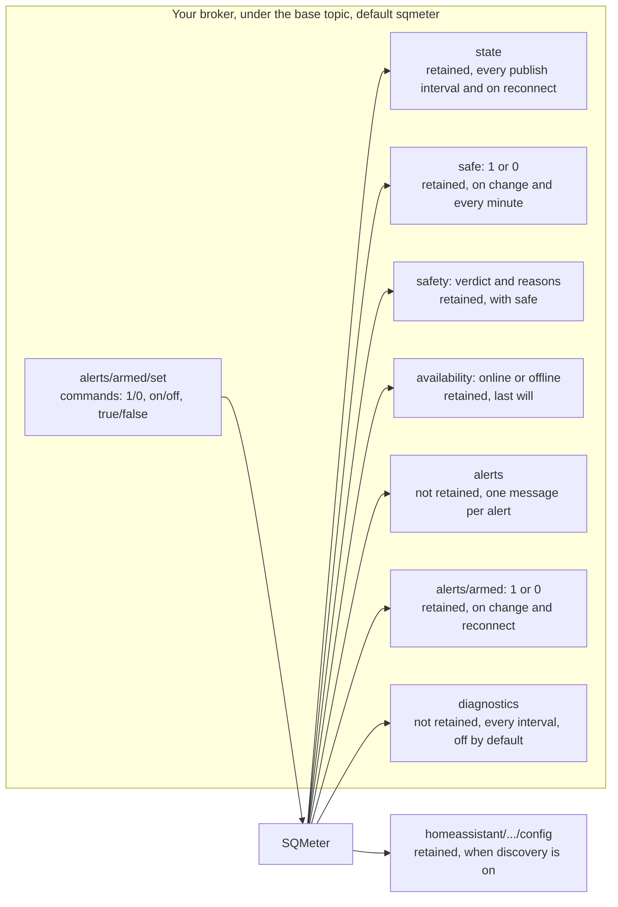

# MQTT Integration

SQMeter publishes its readings, the safety verdict and alerts to any MQTT broker, and can announce itself to Home Assistant automatically.

---

## Enabling MQTT

In **Settings → Network → MQTT**, turn on **Publish to a broker** and set the broker, credentials, **Base topic** (default `sqmeter`) and how often readings are sent. The same settings over the API:

```json
{
  "mqtt": {
    "enabled": true,
    "broker": "192.168.1.10",
    "port": 1883,
    "username": "mqttuser",
    "password": "mqttpass",
    "topic": "sqmeter",
    "publishIntervalMs": 60000,
    "publish": { "sky": true, "environment": true, "clouds": true, "gps": true, "rain": true, "wind": true, "safety": true, "diagnostics": false },
    "homeAssistant": { "enabled": true, "discoveryPrefix": "homeassistant" }
  }
}
```

The base topic may use letters, numbers, `_` and `-`, with `/` between levels.

!!! warning "Telemetry, not an interlock"
    MQTT is a plaintext LAN integration. Use it for telemetry and automation; keep physical safety interlocks independent.

---

## Topics

| Topic | Retained | Payload | When |
|---|---|---|---|
| `<base>/availability` | Yes | `online` / `offline` (last will) | On connect / disconnect |
| `<base>/state` | Yes | The readings document (below) | Every publish interval, and on reconnect |
| `<base>/safe` | Yes | `1` safe, `0` unsafe | On every change, refreshed every minute |
| `<base>/safety` | Yes | The safety object - same as [`GET /api/safety`](../api/rest.md#get-apisafety) | With `<base>/safe` |
| `<base>/alerts` | No | One message per alert (with **Settings → Alerts → MQTT** on): `{"event","events"?,"title","message","level","device","timestamp"}` | Each alert |
| `<base>/alerts/armed` | Yes | `1` alerts on, `0` off | On change and reconnect |
| `<base>/alerts/armed/set` | - | Subscribed: `1`/`0`, `on`/`off`, `true`/`false` switch alerts on or off | Command |
| `<base>/diagnostics` | No | Light-sensor sample counts and RG-15 serial counters - same as `/api/status` → `diagnostics` | Every publish interval, when enabled |

Booleans are `1`/`0`; availability uses Home Assistant's `online`/`offline`.

<!-- diagram: DIA-09
sources: src/WebServer.cpp#WebServer::publishMqttReadings src/WebServer.cpp#WebServer::publishMqttSafety src/WebServer.cpp#WebServer::publishArmedState src/WebServer.cpp#WebServer::publishDiscovery src/MQTTClient.cpp src/AlertDispatcher.cpp#AlertDispatcher::dispatch
blocking: false
fingerprint: unconfirmed
-->
<figure class="diagram" markdown>



<figcaption>MQTT topic map: what SQMeter publishes (arrows out) and the one topic it listens to (arrow in).</figcaption>
</figure>

??? info "Diagram in words"

    Under the base topic (default `sqmeter`), SQMeter publishes:

    - `state` - the readings document, retained, every publish interval and on reconnect;
    - `safe` (`1`/`0`) and `safety` (the verdict with its reasons), retained, on every change and refreshed every minute;
    - `availability` - `online`, or `offline` as the last will, retained;
    - `alerts` - one message per alert, not retained (with the MQTT alert channel on);
    - `alerts/armed` - `1`/`0`, retained, on change and on reconnect;
    - `diagnostics` - not retained, every publish interval, only when switched on.

    It listens on `alerts/armed/set` (`1`/`0`, `on`/`off`, `true`/`false`) to switch alerts on or off.

    With Home Assistant discovery on, it also publishes retained `config` topics under the discovery prefix (default `homeassistant`), and clears them when discovery is switched off or moved.

### Choosing what's published

**Settings → Network → MQTT → Publish** switches each part on or off:

| Switch | Controls |
|---|---|
| Sky quality and light | `light` and `sky` in `<base>/state` |
| Temperature, humidity, pressure | `environment` |
| IR and cloud cover | `infrared` and `clouds` |
| GPS, Rain, Wind | `gps`, `rain`, `wind` (only when that hardware is enabled) |
| Safe / unsafe | `<base>/safe` and `<base>/safety` |
| Diagnostics | `<base>/diagnostics` (off by default) |

---

## Readings (`<base>/state`)

The same document as [`GET /api/sensors`](../api/rest.md#get-apisensors) and `/ws/sensors`, minus the `safety` object (it has its own topics) and any groups switched off:

```json
{
  "timestamp": 1791401772,
  "timeValid": true,
  "dataAgeMs": 412,
  "dataStale": false,
  "light": { "status": "ok", "ageMs": 400, "lux": 0.0003, "visible": 307, "infrared": 47, "full": 357, "gain": "MAX", "gainFactor": 9876, "integrationMs": 600, "saturated": false, "nightMode": true },
  "sky": { "status": "ok", "sqm": 21.48, "rawSqm": 21.41, "nelm": 6.2, "bortle": 2, "description": "Typical truly dark site", "calibrated": false, "averagingWindowSeconds": 90 },
  "environment": { "status": "ok", "ageMs": 3100, "temperature": 12.3, "humidity": 64.7, "pressure": 1013.4, "dewpoint": 6.1 },
  "infrared": { "status": "ok", "ageMs": 3100, "skyTemperature": -24.7, "ambientTemperature": 12.4 },
  "clouds": { "status": "ok", "coverPercent": 3, "condition": "clear", "description": "Clear", "temperatureDelta": -37.1, "correctedDelta": -33.0, "humidity": 64.7, "humiditySource": "measured" },
  "gps": { "status": "ok", "ageMs": 750, "fix": true, "satellites": 9, "latitude": 51.5074, "longitude": -0.1278, "altitude": 42.0, "hdop": 1.1 },
  "rain": { "status": "ok", "ageMs": 40, "raining": false, "rainingNow": false, "intensity": 0.0, "eventAccumulation": 0.4, "sensorEventAccumulation": 0.4, "totalAccumulation": 12.6, "lensFault": false, "emitterSaturated": false },
  "wind": { "status": "ok", "ageMs": 900, "speed": 3.3, "gust": 6.8, "direction": 246, "vaneFault": false }
}
```

- **`timestamp`** is Unix seconds; `timeValid` is `false` (and `timestamp` `0`) until the clock is set.
- **`status`** is `ok`, `missing` (not detected or not responding), `error` or `stale`. A group whose status isn't `ok` carries only `status` and `ageMs` (no `ageMs` when `missing` - it has never answered) - never zeros that look like readings.
- **`gps`, `rain`, `wind`** are only present when that hardware is enabled.
- **Units**: °C, %, hPa, lux, mag/arcsec², m/s, degrees (0 = north), mm and mm/h (an RG-15 set to inches is converted). `wind.direction` is left out when it's calm or there's no vane.
- **`rain.raining`** is held for the rain clear delay after the last drop; `rainingNow` is instantaneous. `eventAccumulation` is cleared by the clear delay; `sensorEventAccumulation` is the RG-15's own event total.
- **`clouds.humiditySource`** is `assumed` when there's no humidity sensor (53% is used).

---

## Home Assistant

Turn on **Settings → Network → MQTT → Home Assistant → MQTT discovery**. SQMeter then appears as a device with:

- **Sensors**: sky quality, limiting magnitude, Bortle class, illuminance, temperature, humidity, pressure, dew point, sky temperature, cloud cover, rain intensity, wind speed, gust and direction - for the groups you publish
- **Binary sensors**: *Raining* (moisture) and *Observatory* (safety: on = unsafe)
- **Switch**: *Alerts* - turn alerts off while you're not imaging

Each entity is unavailable while the device is offline or its sensor isn't `ok`. Switching a group off removes its entities. The discovery prefix defaults to `homeassistant`.

Without discovery, read `<base>/state` with a `value_template`:

```yaml
mqtt:
  sensor:
    - name: "Sky quality"
      state_topic: "sqmeter/state"
      value_template: "{{ value_json.sky.sqm }}"
      unit_of_measurement: "mag/arcsec²"
```

See [Alerts](alerts.md) for the alert events.

---

## Mosquitto Test

```bash
mosquitto_sub -h <broker-ip> -t 'sqmeter/#' -v
```
