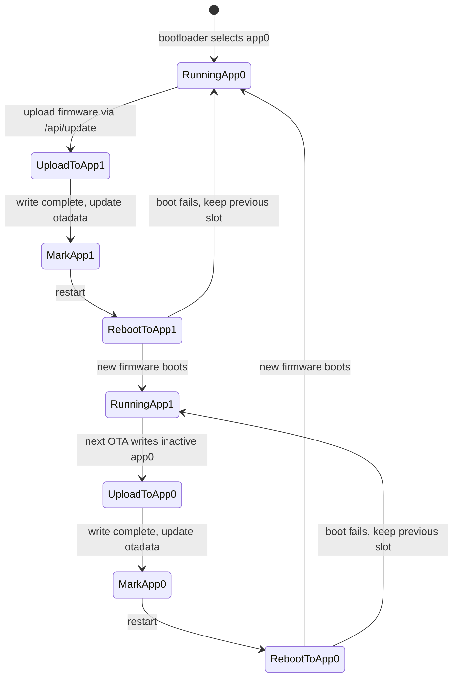

# OTA Updates

Update firmware over WiFi without a USB cable.

---

## Via Web UI (Recommended)

1. Download `sqmeter-firmware-vX.Y.Z.bin` from [GitHub Releases](https://github.com/DeanJ87/SQMeter/releases)
2. Open the web UI and go to **System**
3. Under **Firmware Update**, select the `.bin` file
4. Click **Upload**
5. The device reboots automatically into the new firmware

!!! warning "Don't interrupt"
    Keep the browser open during upload. A power cut mid-flash can corrupt the active partition — the device will fall back to the previous app slot on next boot.

!!! note "Web UI updates"
    To update the web UI (the dashboard/settings pages), flash `sqmeter-littlefs-vX.Y.Z.bin` via the web UI's **Filesystem Update** section, or use esptool directly. The web UI update doesn't touch the firmware.

!!! warning "Security"
    The current OTA endpoints are unauthenticated LAN endpoints. Anyone who can reach the device web UI can attempt firmware or filesystem uploads. Keep the device on a trusted network and do not expose it through port forwarding.

---

## API Endpoints

The System page uses these endpoints:

| Endpoint | Purpose | Artifact |
|----------|---------|----------|
| `POST /api/update` | Firmware OTA update | `sqmeter-firmware-vX.Y.Z.bin` |
| `POST /api/update/fs` | LittleFS/web UI update | `sqmeter-littlefs-vX.Y.Z.bin` |

Both endpoints expect `multipart/form-data` uploads and return JSON with `success` on completion or `error` on failure. The firmware endpoint reboots automatically after a successful upload.

---

## Via ArduinoOTA

Command-line ArduinoOTA is disabled by default. To enable it, set both fields below in the device configuration and restart:

```json
{
  "ota": {
    "enabled": true,
    "password": "use-a-long-random-password"
  }
}
```

Use the same password from your upload tool. If `ota.enabled` is false or `ota.password` is empty, the device will not start the ArduinoOTA listener.

---

## Via esptool (USB)

If the device is unresponsive over WiFi, fall back to USB:

```bash
# Firmware only
esptool.py --chip esp32 --port PORT --baud 115200 \
  write_flash 0x10000 sqmeter-firmware-vX.Y.Z.bin

# Full reflash (nuclear option)
esptool.py --chip esp32 --port PORT --baud 115200 \
  write_flash 0x0 sqmeter-complete-flash-vX.Y.Z.bin
```

---

## How OTA Works

The partition table has two app slots (`app0` at `0x10000`, `app1` at `0x190000`). OTA writes the new firmware to the inactive slot, then updates the `otadata` partition to point the bootloader at it on next boot. If the new firmware fails to boot, the bootloader stays on the old slot.



This means you always have a working rollback as long as you don't erase the flash.

The LittleFS filesystem update is separate from app OTA slots. It replaces the dashboard/settings assets and preserves NVS configuration, but an interrupted filesystem upload can leave the web UI unavailable until LittleFS is flashed again over USB or a later successful OTA filesystem upload.
