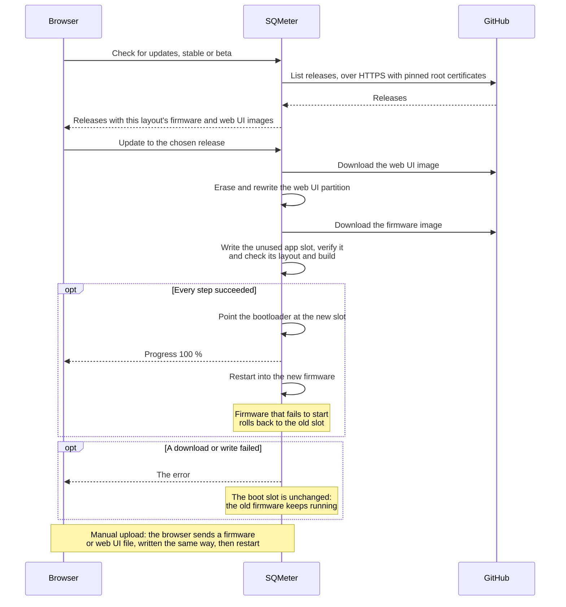

# OTA Updates

Update firmware over WiFi without a USB cable.

---

## Check for Updates (Recommended)


The **Updates** page can check GitHub Releases directly and update the device itself - no downloading or uploading required.

1. Open the web UI and go to **Updates**
2. Under **Firmware**, pick a **Release track**:
    - **Stable** - tagged releases (`prerelease: false` on GitHub)
    - **Beta** - pre-release builds (`prerelease: true` on GitHub)
3. Pick a specific release from the dropdown (defaults to the newest on the selected track) - a badge shows whether it's newer than the running firmware
4. Click **Update to `<tag>`**

In the list, the release you're running is marked **installed** and older ones **older**:

- The installed release can't be installed again: its button reads **Installed**.
- Choosing an older release turns the button into a red **Downgrade to `<tag>`**, with a warning. Older firmware may not read settings saved by a newer one; if it can't, it starts with defaults and you set it up again from its WiFi hotspot.

Only releases for this device's partition layout are listed: v0.3 and later (files named `sqmeter-l2-*`). A device on v0.2 doesn't see v0.3 here; it moves to it with the [one-time USB flash](../getting-started/usb-flash.md).

The device downloads `sqmeter-l2-firmware-<tag>.bin` and `sqmeter-l2-littlefs-<tag>.bin` from GitHub over HTTPS and flashes both before rebooting - firmware and web UI are updated together as a matched pair. The web UI is written first; the device only switches to the new firmware once that's written and checked, so a failure keeps the old firmware running. A failure after the web UI is written can leave the new web UI with the old firmware until you retry. A release only appears in the list if both files exist for it. On the Bluetooth build the device fetches `sqmeter-l2-ble-firmware-<tag>.bin` instead, so it stays on the Bluetooth build.

Progress and errors are pushed to the page over the status WebSocket; if the connection to GitHub fails partway through (no internet, DNS, etc.), the device aborts cleanly and keeps running exactly what it was running before - see [How self-update failure handling works](#how-self-update-failure-handling-works) below.

!!! note "TLS"
    The device validates GitHub's certificate chain against two pinned root CAs (covering `api.github.com` and the release-asset CDN) rather than trusting any certificate - it will refuse to update if GitHub's certificate doesn't chain to one of them.

---

## Via Web UI (Manual Upload)

1. Download `sqmeter-l2-firmware-vX.Y.Z.bin` (or `sqmeter-l2-ble-firmware-vX.Y.Z.bin` for the Bluetooth build) from [GitHub Releases](https://github.com/DeanJ87/SQMeter/releases)
2. Open the web UI and go to **Updates**
3. Under **Manual upload**, choose **Firmware** as the image and select the `.bin` file
4. Click **Upload**
5. The device reboots automatically into the new firmware

If switching the device to the new firmware fails once after a complete upload ("Could not activate partition"), it checks the image again and retries the switch before answering; the API reply then includes `"retried": true`.

!!! note "Files the device refuses"
    Every firmware file carries the partition layout and build it's made for. The device checks it
    before switching to the new firmware and refuses, with `400` and a reason, a file that isn't for
    this device: a v0.2 file ("Not firmware for this device..."), the other build ("Wrong build: this
    device needs the Bluetooth build."), or another layout. A web UI file must fill this device's
    web UI partition exactly; one made for a different layout is refused before anything is erased.

!!! warning "Don't interrupt"
    Keep the browser open during upload. A power cut mid-flash leaves the slot being written incomplete; it's never booted, so the device keeps starting the firmware it was running.

!!! note "Web UI updates"
    To update the web UI (the dashboard/settings pages), upload `sqmeter-l2-littlefs-vX.Y.Z.bin` under **Manual upload** with **Web UI (littlefs.bin)** as the image, or use esptool directly. The web UI update doesn't touch the firmware.

!!! warning "Security"
    Updates are open to anyone who can reach the web UI unless **Settings → Device → Security → Password-protect changes** is on. Even then the login is plain HTTP: keep the device on a trusted network and don't expose it through port forwarding.

---

## API Endpoints

The Updates page uses these endpoints:

| Endpoint | Purpose | Artifact |
|----------|---------|----------|
| `GET /api/updates/check?track=stable\|beta` | List GitHub releases with a matched firmware+filesystem asset pair, filtered by track | - |
| `POST /api/updates/apply` | Self-download and flash a specific release. Body: `{"firmwareAssetUrl","firmwareAssetSize","fsAssetUrl","fsAssetSize"}` (from a `check` response entry) | fetched from GitHub |
| `POST /api/update` | Manual firmware upload | `sqmeter-l2-firmware-vX.Y.Z.bin` |
| `POST /api/update/fs` | Manual LittleFS/web UI upload | `sqmeter-l2-littlefs-vX.Y.Z.bin` |

Both upload endpoints take `multipart/form-data` and return `200 {"success": true}`, `400 {"error": "..."}` for a file that isn't for this device (nothing was changed), or `500 {"error": "..."}` when writing failed. The device restarts after a successful upload.

---

## Version Numbers

The badge on the Updates page compares the running version with each release using semantic-version order: `0.2.0-beta.1` < `0.2.0-beta.2` < `0.2.0`. Release builds report their tag (without the `v`). A build you compile yourself reports the latest release plus `+dev` (for example `0.2.0-beta.1+dev`), which counts as that release - so newer releases show as updates and older ones don't.

---

## Via ArduinoOTA

Command-line ArduinoOTA is disabled by default. To enable it, set both fields below in the device configuration and restart:

```json
{
  "ota": {
    "enabled": true,
    "password": "use-a-long-random-password"
  }
}
```

Use the same password from your upload tool. If `ota.enabled` is false or `ota.password` is empty, the device will not start the ArduinoOTA listener.

---

## Via esptool (USB)

If the device is unresponsive over WiFi, fall back to USB:

```bash
# Firmware only
esptool.py --chip esp32 --port PORT --baud 460800 \
  write_flash 0x10000 sqmeter-l2-firmware-vX.Y.Z.bin
```

For everything at once (settings kept), use the release's USB package - see [One-time USB flash](../getting-started/usb-flash.md).

---

## How OTA Works

The partition table has two app slots (`app0` at `0x10000`, `app1` at `0x1D0000`, 1.75 MB each). OTA writes the new firmware to the slot that isn't running; the image is verified when the write finishes, and only then is the bootloader pointed at it for the next boot. A partial or corrupt download is therefore never booted.

A new firmware is only kept once it has started properly: WiFi, the web server and every other service up (since v0.3). If it crashes or restarts before then, the bootloader goes back to the previous slot on the next boot. Once it has started it is kept, even if it misbehaves later, so the way back from a bad release is to install another one (or the previous one) from **Updates**, or over USB.

<!-- diagram: DIA-08
sources: src/OtaUpdater.cpp#OtaUpdater::runApply src/OtaUpdater.cpp#OtaUpdater::downloadAndFlashFirmware src/OtaUpdater.cpp#OtaUpdater::downloadAndFlashFilesystem lib/ReleaseLogic/ src/OtaUpdater.cpp#OtaUpdater::checkForUpdate
blocking: false
fingerprint: f12a398fa1d44506
-->
<figure class="diagram" markdown>


```mermaid
sequenceDiagram
    accTitle: Updating from GitHub releases
    accDescr: The browser asks the device for releases; the device fetches the list from GitHub itself. On Update, the device downloads and writes the web UI image first and the firmware last, switching the boot slot only after the firmware is verified and found to be for this layout and build, then restarts. Any failure before that leaves the old firmware booting, and new firmware that fails to start is rolled back.
    participant B as Browser
    participant D as SQMeter
    participant G as GitHub
    B->>D: Check for updates, stable or beta
    D->>G: List releases, over HTTPS with pinned root certificates
    G-->>D: Releases
    D-->>B: Releases with this layout's firmware and web UI images
    B->>D: Update to the chosen release
    D->>G: Download the web UI image
    D->>D: Erase and rewrite the web UI partition
    D->>G: Download the firmware image
    D->>D: Write the unused app slot, verify it<br/>and check its layout and build
    opt Every step succeeded
        D->>D: Point the bootloader at the new slot
        D-->>B: Progress 100 %
        D->>D: Restart into the new firmware
        Note over D: Firmware that fails to start<br/>rolls back to the old slot
    end
    opt A download or write failed
        D-->>B: The error
        Note over D: The boot slot is unchanged:<br/>the old firmware keeps running
    end
    Note over B,D: Manual upload: the browser sends a firmware<br/>or web UI file, written the same way, then restart
```

<figcaption>Updating from GitHub releases, and manual upload. Progress reaches the page over the status WebSocket.</figcaption>
</figure>

??? info "Diagram in words"

    1. **Check**: the browser asks the device for releases on the stable or beta track. The device fetches the list from GitHub itself, over HTTPS checked against pinned root certificates, and returns only releases that have both a firmware image for this layout (the Bluetooth one on the BLE build) and a web UI image.
    2. **Update**: the browser sends the chosen release. The device downloads the **web UI image first**, erasing and rewriting the web UI (LittleFS) partition as it goes, then the **firmware**, written to the app slot that isn't running and verified when complete, including that it's for this layout and build.
    3. **Success**: only after the firmware is verified does the device point the bootloader at the new slot, report 100 % and restart into the new firmware.
    4. **Failure** (no internet, a failed download or write): the device reports the error and the boot slot is unchanged, so the old firmware keeps running. A failure during the web UI write can leave the web UI unusable until a later update succeeds; the REST API and update endpoints still work.
    5. **Manual upload**: the browser sends a firmware or web UI file to the device, which writes it the same way and restarts.
    6. If the new firmware is invalid or fails before it has started properly (WiFi and the web server up), the bootloader returns to the previous slot; once it has started, it's kept.

The LittleFS filesystem update is separate from app OTA slots. It replaces the dashboard/settings assets and preserves NVS configuration, but an interrupted filesystem upload can leave the web UI unavailable until LittleFS is flashed again over USB or a later successful OTA filesystem upload.

---

## How Self-Update Failure Handling Works

`POST /api/updates/apply` flashes the **filesystem first, then the firmware**, and only reboots once both have succeeded - deliberately the reverse of upload order, because writing the new firmware is the one irreversible step (it flips the boot partition the instant it succeeds). If the device loses connectivity or power at any point:

- **Before the firmware write starts** (checking, or mid-filesystem-download): nothing has changed that affects what boots next time. The device keeps running exactly what it was running before.
- **During the firmware write**: the write is aborted and the boot partition is left untouched, same as above.
- **After the firmware write succeeds but before reboot**: this can't happen in practice - the reboot is triggered immediately after the firmware write completes, with no further network calls in between.

In all cases config (WiFi, calibration, thresholds) is untouched, since it lives entirely in NVS, a separate partition from both `app0`/`app1` and the LittleFS filesystem.

One known, pre-existing limitation shared with the manual filesystem-upload endpoint: the filesystem partition is erased before being rewritten, so a connection drop specifically *during* the filesystem write (not before, not after) leaves LittleFS corrupted until a later successful update repairs it. The REST API and OTA endpoints stay reachable either way - only the served dashboard/settings pages would be affected until then.
