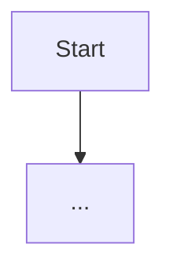

# Contract: Diagram Block

The Markdown shape that `tools/docs/diagrams.py` and `web/scripts/check-diagrams.mjs` enforce. Field rules are in [data-model.md](../data-model.md).

## In docs pages (`docs/**/*.md`)

````markdown
<!-- diagram: DIA-02
sources: lib/AlpacaLogic/src/SafetyEvaluator.cpp lib/DeviceCore/src/DeviceCore.cpp#safetyInputs
blocking: true
fingerprint: 0123456789abcdef
-->
<figure class="diagram" markdown>



<figcaption>How the safety verdict is decided.</figcaption>
</figure>

??? info "Diagram in words"

    1. ...
    2. ...
````

- The metadata comment comes immediately before `<figure>`; blank lines in between are allowed.
- `<figure class="diagram" markdown>` requires `md_in_html`, which is already enabled.
- `??? info "Diagram in words"` is a collapsed `<details>` (pymdownx.details), so it reads without JavaScript.

## In README.md (GitHub)

GitHub ignores `<figure markdown>`, so the README uses:

````markdown
<!-- diagram: DIA-01
sources: ...
fingerprint: ...
-->
```mermaid
...
```
*Figure: What SQMeter connects to.*

<details><summary>Diagram in words</summary>

...
</details>
````

The README body must equal the `docs/index.md` body for the same ID (FR-012).

## Not allowed

- `classDef`, `style`, `linkStyle` and `%%{init: …}%%` theme overrides (FR-003).
- Diagram types the renderer or GitHub doesn't support (for example `zenuml`, which is an external plugin).
- A mermaid fence without the metadata comment.
